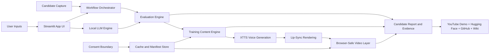
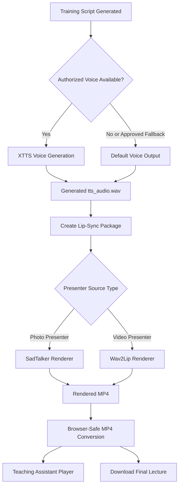

> Building a local-first AI mentor studio that does not only **ask interview questions** — it reads resumes and job descriptions, evaluates candidate answers, generates adaptive learning plans, captures interview evidence, creates consent-based voice output, and renders digital-human training videos through a complete interview-to-training workflow.

[GitHub Repository](https://github.com/dranubhaparashar/ASHU-Mentor-AI-Studio)

---

> 🎥 **Live demo video:** [youtu.be/2XXnTbtjREs](https://youtu.be/2XXnTbtjREs)
>
> 🚀 **Try it live:** [Hugging Face Space](https://huggingface.co/spaces/AnubhaParashar/ASHU)
>
> 📦 **GitHub repository:** [dranubhaparashar/ASHU-Mentor-AI-Studio](https://github.com/dranubhaparashar/ASHU-Mentor-AI-Studio)
>
> 📚 **Wiki documentation:** [Architecture · Technical Specification · Security Governance](https://github.com/dranubhaparashar/ASHU-Mentor-AI-Studio/wiki)

---

## Vision

Interview preparation, candidate screening, technical assessment, and training content generation are usually handled by separate tools. A candidate may use one platform for resume-based questions, another for coding practice, another for mock interview feedback, and another for training videos. This creates a fragmented workflow where evaluation evidence, learning gaps, training recommendations, and teaching content are not connected.

**ASHU Mentor AI Studio** converts this fragmented process into a single local-first AI mentoring studio.

It takes a resume, job description, training topic, candidate responses, optional presenter assets, and optional authorized voice samples. The system then generates structured interview questions, evaluates candidate readiness, recommends adaptive training, and produces digital-human teaching output.

The project is designed around one practical question:

**Can an AI system conduct a structured interview, evaluate candidate readiness, recommend adaptive training, and generate digital-human teaching content while keeping candidate evidence and presenter consent clearly separated?**

ASHU Mentor AI Studio answers this by combining:

- resume-aware interview question generation
- job-description-aware interview simulation
- candidate answer evaluation and scoring
- coding-round and technical-round support
- adaptive training recommendations
- candidate evidence capture and report export
- concept slides and teaching script generation
- consent-based XTTS voice generation
- SadTalker/Wav2Lip-based lip-sync rendering
- browser-safe MP4 generation for playback
- cached media reuse to avoid repeated slow rendering
- Hugging Face Space deployment for public demonstration
- GitHub repository and Wiki documentation

---

## Project Attributes

| Attribute | Description |
|---|---|
| `problem-statement` | Interview practice, candidate evaluation, learning-gap analysis, and training video generation are often disconnected. Users need one guided system that can move from resume/JD-based questioning to evaluation, training recommendation, and digital-human teaching output. |
| `primary-objective` | Build an end-to-end AI mentor platform for interviews, evaluation, adaptive training, and consent-based digital-human lecture generation. |
| `core-technologies` | Python, Streamlit, local LLM orchestration, XTTS/Coqui voice generation, SadTalker, Wav2Lip, FFmpeg, browser-safe MP4 rendering, Hugging Face Spaces, GitHub Wiki documentation. |
| `runtime-interface` | Streamlit dashboard with interview tabs, training hub, digital presenter preview, media player, progress indicators, report downloads, and architecture documentation. |
| `input-scope` | Resume, job description, training topic, candidate answers, coding responses, authorized presenter source, authorized voice sample, and candidate evidence. |
| `output-scope` | Interview questions, candidate scores, evaluation report, adaptive training plan, teaching script, generated XTTS audio, lip-sync video, browser-safe MP4, logs, and evidence bundle. |
| `deployment-target` | Local WSL/Conda runtime for full voice/video rendering, Hugging Face Space for public demo, GitHub repository, YouTube walkthrough, and GitHub Wiki. |
| `demo-surface` | Public Hugging Face Space showing the interface and workflow. Full private interview capture, local file paths, presenter media, and heavy voice/video rendering work best locally. |
| `key-capabilities` | Interview generation, answer scoring, adaptive training, candidate evidence capture, digital-human teaching, XTTS voice generation, lip-sync video rendering, report export, and cached media reuse. |
| `production-focus` | Designed for interview coaching, candidate readiness assessment, AI training demonstrations, digital presenter experiments, and education/training workflows. |

---

## System Architecture


ASHU Mentor AI Studio follows a local-first, consent-aware architecture. The user provides a resume, job description, training topic, candidate responses, and optionally an authorized voice or presenter source. The Streamlit UI routes these inputs through a workflow orchestrator. The local LLM engine generates interview questions, explanations, feedback, and adaptive training plans. The evaluation engine scores candidate responses and identifies learning gaps. The training content engine generates scripts, concept explanations, and teaching material. The voice and lip-sync pipeline then produces digital-human lecture output only when the required presenter and voice permissions are available.



The architecture has four important boundaries:

1. **Candidate boundary** — candidate evidence is captured for interview assessment and reporting.
2. **Presenter boundary** — presenter image/video is used only when explicitly authorized.
3. **Voice boundary** — XTTS voice generation requires an authorized voice sample or approved fallback.
4. **Deployment boundary** — full heavy rendering works best locally, while Hugging Face is used for public demonstration and UI access.

---

## Interview and Training Workflow

The ASHU Mentor AI Studio workflow converts a candidate profile into an interview, evaluation, and adaptive training path through six major stages:

1. **Input Collection** — collect resume, job description, training topic, candidate guidelines, uploaded sources, and optional voice/presenter assets.
2. **Interview Generation** — generate resume-aware and JD-aware interview questions, technical prompts, coding tasks, and probing questions.
3. **Candidate Capture** — capture candidate responses, transcript evidence, screenshots, focus-change events, and behavioral signals for review.
4. **Evaluation and Gap Analysis** — score answers, coding responses, clarity, role fit, strengths, weaknesses, and readiness level.
5. **Adaptive Training Plan** — convert gaps into learning modules, concept explanations, checkpoint questions, and teaching scripts.
6. **Digital-Human Lecture Rendering** — generate XTTS audio, create lip-sync video using SadTalker or Wav2Lip, convert to browser-safe MP4, and make the final lecture available for playback or download.

The final output is not only an interview score. It is a complete evidence-backed learning and training package.

---

## Why This Matters

> [!NOTE]
> Interview tools usually stop at question generation or mock feedback. ASHU Mentor AI Studio goes further by connecting interview simulation, evaluation, gap detection, adaptive training, and digital-human teaching output.

> [!IMPORTANT]
> The platform separates candidate evaluation from digital presenter generation. This is critical because candidate evidence and presenter assets have different consent requirements.

> [!TIP]
> The strongest project value is the complete workflow: resume/JD input → interview → evaluation → adaptive training → generated lecture → report/export.

> [!WARNING]
> ASHU Mentor AI Studio should not be used for real hiring decisions without human review. It provides structured assessment and training support, but final judgment should remain human-owned.

> [!CAUTION]
> The hosted Hugging Face Space is best for showing the interface and demo workflow. Full private interview runs, authorized media assets, local file paths, XTTS voice generation, and lip-sync rendering should be tested locally.

---

## Core Capability Map

| Capability | What It Does |
|---|---|
| Resume-Aware Interview | Reads resume details and generates personalized interview questions. |
| JD-Aware Interview Simulation | Uses the job description to align questions with role expectations. |
| Coding Round Support | Supports technical and coding-style assessment workflows. |
| Candidate Evaluation | Scores answers, clarity, confidence, technical strength, and role fit. |
| Adaptive Training Planner | Converts weaknesses into learning plans, concepts, and practice checkpoints. |
| Digital Presenter Preview | Allows training content to be delivered through a digital-human teaching assistant. |
| XTTS Voice Generation | Generates speech using an authorized voice sample or approved fallback. |
| Lip-Sync Rendering | Uses SadTalker for photo-based presenters and Wav2Lip for video-based presenters. |
| Browser-Safe Video Layer | Converts rendered video into H.264/AAC MP4 for reliable browser playback. |
| Cache and Manifest Store | Reuses generated audio/video and metadata to avoid slow repeated generation. |
| Evidence and Reporting | Exports candidate reports, transcripts, logs, generated outputs, and evidence bundles. |
| Deployment and Sharing | Supports local runtime, Hugging Face demo, YouTube walkthrough, GitHub repository, and Wiki documentation. |

---

## Dashboard Modules

| Tab | Purpose |
|---|---|
| Interview Setup | Collect resume, job description, candidate details, and interview configuration. |
| Interview Session | Ask questions, collect candidate answers, and support structured assessment. |
| Coding Round | Present coding or technical tasks and evaluate responses. |
| Evaluation Dashboard | Show score, strengths, weaknesses, clarity, role fit, and readiness summary. |
| Training Hub | Generate adaptive lessons, teaching scripts, concept summaries, and checkpoints. |
| Digital Presenter | Preview assistant video and select presenter/voice options. |
| Voice Generation | Run XTTS in a separate voice environment to avoid dependency conflicts. |
| Lip-Sync Pipeline | Render SadTalker or Wav2Lip output as a background job. |
| Media Player | Play generated browser-safe MP4 lecture videos. |
| Report Downloads | Export candidate report, evidence bundle, logs, and generated media. |
| Architecture Docs | Show system architecture and workflow diagrams inside the app. |

---

## Digital Presenter Voice and Lip-Sync Pipeline

The digital presenter workflow is designed for consent-based lecture generation. Candidate interview evidence is never automatically reused as the presenter. Presenter media and voice samples are separate assets that require explicit authorization.



This pipeline is intentionally separated from the interview capture pipeline to prevent accidental reuse of candidate identity, face, or voice in generated training media.

---

## Background Pipeline and Cache

The voice and video generation process can be slow because XTTS and SadTalker/Wav2Lip are deep-learning workloads. ASHU Mentor AI Studio supports background rendering and cached media reuse.

Recommended workflow:

1. Generate the lecture once using **Start full background pipeline: voice + video**.
2. Use **Prefetch latest generated audio/video** for later demos.
3. Reuse cached media if the script, presenter source, and voice sample have not changed.
4. Use **Force regenerate** only when the script, presenter, or voice sample changes.

This makes the platform practical for demonstrations because repeated playback does not require repeated heavy rendering.

---

## Evidence Pack Structure

ASHU Mentor AI Studio can produce a structured output package for candidate review, training handoff, and project demonstration.

```text title="report_exports"
report_exports/
  candidate_report_<timestamp>.md
  candidate_report_<timestamp>.json
  transcript_<timestamp>.txt
  interview_scores_<timestamp>.json
  training_plan_<timestamp>.md
  generated_teaching_script_<timestamp>.txt
  media_manifest_<timestamp>.json
  generated_audio/
    tts_audio.wav
  generated_video/
    final_lecture_browser_safe.mp4
  logs/
    app_log.txt
    voice_generation_log.txt
    lipsync_render_log.txt
```

The evidence package supports:

- candidate readiness review
- interview coaching
- technical-round feedback
- training recommendation
- generated lecture replay
- audit of consent-based presenter and voice assets
- demo documentation for GitHub, Hugging Face, and YouTube

---

## Safety and Governance Model

ASHU Mentor AI Studio is agentic and generative, but it must remain consent-aware.

| Area | Safety Behavior |
|---|---|
| Candidate capture | Used only for interview evidence, evaluation, and reporting. |
| Presenter source | Must be separately authorized before digital-human rendering. |
| Voice sample | XTTS voice generation must use an authorized sample or approved fallback. |
| Candidate identity | Candidate face/voice is not reused as presenter unless separately authorized. |
| Fallback audio | Automated fallback voice requires user approval. |
| Generated media | Final lecture output is labeled as generated training content. |
| Reports | Candidate reports are evidence-backed and should not be treated as final hiring decisions without human review. |
| Deployment | Public demo surfaces should avoid private candidate data and unauthorized voice/presenter assets. |

The key design principle is simple:

> **Candidate evidence is for evaluation. Presenter assets are for generated teaching. The two should never be mixed without explicit authorization.**

---

## Runtime Example

```bash title="run-locally.sh"
# Clone the repo
git clone https://github.com/dranubhaparashar/ASHU-Mentor-AI-Studio.git
cd ASHU-Mentor-AI-Studio

# Activate main app environment
conda activate chatbot

# Run dashboard
ASHU_VOICE_ENV=voice \
COQUI_TOS_AGREED=1 \
PYTHONNOUSERSITE=1 \
python -m streamlit run app.py --server.fileWatcherType none
```

For voice environment validation:

```bash title="validate-voice-env.sh"
conda activate voice

PYTHONNOUSERSITE=1 python -c "import numpy, scipy, torch; print('numpy', numpy.__version__); print('scipy', scipy.__version__); print('torch', torch.__version__)"

COQUI_TOS_AGREED=1 PYTHONNOUSERSITE=1 python -c "from TTS.api import TTS; TTS('tts_models/multilingual/multi-dataset/xtts_v2'); print('XTTS model load OK')"
```

---

## Hugging Face Space Deployment

For Hugging Face deployment, keep the Space configuration at the top of `README.md` and keep `requirements.txt` as a clean package list.

```yaml title="README.md Space Header"
---
title: ASHU Mentor AI Studio
emoji: 🎓
colorFrom: blue
colorTo: indigo
sdk: streamlit
sdk_version: "1.25.0"
app_file: app.py
pinned: false
---
```

The Hugging Face Space is useful for public UI demonstration, project showcasing, and live walkthroughs. Full local voice cloning, private file paths, and heavy lip-sync rendering may work better in local WSL/Conda environments.

---

## Public Demo Surfaces

> [!IMPORTANT]
> The hosted demo is best for showing the interface, workflow, and project concept. Full private interview runs, local assets, authorized presenter media, voice samples, and heavy rendering should be tested locally.

### Demo Links

- **🚀 Live App:** [ASHU Mentor AI Studio on Hugging Face Spaces](https://huggingface.co/spaces/AnubhaParashar/ASHU)
- **🎥 Demo Video:** [ASHU Mentor AI Studio YouTube Demo](https://youtu.be/2XXnTbtjREs)
- **📦 GitHub Repository:** [ASHU-Mentor-AI-Studio](https://github.com/dranubhaparashar/ASHU-Mentor-AI-Studio)
- **📚 Wiki Documentation:** [ASHU Mentor AI Studio GitHub Wiki](https://github.com/dranubhaparashar/ASHU-Mentor-AI-Studio/wiki)

---

## Engineering Value

ASHU Mentor AI Studio is not just a Streamlit wrapper around LLM prompts. It demonstrates how interview simulation, candidate evidence, adaptive training, voice generation, and digital-human rendering can be connected into one governed AI workflow.

It is designed to be:

- **measurable** — candidate responses, scores, transcripts, and media outputs are captured as evidence
- **explainable** — evaluation is supported by role-fit reasoning and gap analysis
- **adaptive** — weak areas are converted into training modules and teaching scripts
- **auditable** — reports, manifests, media, and logs can be packaged for review
- **consent-aware** — voice and presenter assets are handled separately from candidate capture
- **demo-ready** — Hugging Face, YouTube, GitHub, and Wiki links create a complete public project surface

---

## Current Strengths

- Local-first execution supports controlled testing and private experimentation.
- Resume/JD-aware questioning makes the interview workflow more personalized.
- Evaluation and training are connected instead of being separate outputs.
- Digital-human rendering makes the system suitable for training demonstrations.
- Cache reuse prevents repeated slow media generation during demos.
- GitHub Wiki pages provide structured documentation for users and reviewers.
- YouTube and Hugging Face links make the project easier to showcase.

---

## Industry Use Cases

| Industry / Team | Use Case |
|---|---|
| Education and Training | Generate structured lessons, concept explanations, and digital-human teaching videos. |
| Interview Coaching | Simulate resume/JD-based interviews and provide candidate readiness feedback. |
| HR and Talent Screening | Support structured pre-screening with human review and evidence-backed reports. |
| Technical Training | Generate coding-round practice, technical explanations, and personalized learning plans. |
| AI Product Demonstrations | Showcase end-to-end GenAI workflow from interview to generated video. |
| Digital Human Research | Experiment with consent-based voice and lip-sync rendering pipelines. |

---

## Next Improvements

- Fix and stabilize Hugging Face deployment for reliable public access.
- Add role-specific evaluation rubrics for software, data science, AI, and product roles.
- Add exportable PDF reports for candidate feedback and training plans.
- Add structured coding-round scoring with test cases and explanation.
- Add consent checklist UI before voice and presenter rendering.
- Add model-provider abstraction for local LLMs, OpenAI, Azure OpenAI, and Gemini.
- Add dashboard-level evidence pack export for demo and review workflows.
- Add video transcript alignment for generated lectures.

---

## Key Innovation

> [!IMPORTANT]
> ASHU Mentor AI Studio connects **interview intelligence**, **candidate evidence**, **adaptive training**, and **digital-human lecture generation** into one local-first workflow. Most tools handle these as disconnected activities: question generation in one place, feedback in another, training material somewhere else, and generated video in a separate pipeline.

It turns:

**Resume/JD input → structured interview → candidate evaluation → learning-gap analysis → adaptive training script → XTTS voice → lip-sync rendering → browser-safe training video → evidence report**

rather than stopping at mock interview questions.

The strongest value is the full pipeline. It allows one project to demonstrate LLM reasoning, training personalization, media generation, consent governance, reporting, and deployable public demo surfaces.

---

## Conclusion

ASHU Mentor AI Studio shows how interview preparation and training can evolve from disconnected tools into an end-to-end AI mentor workflow.

It combines:

- resume-aware questioning
- JD-based assessment
- candidate evidence capture
- adaptive learning recommendations
- voice generation
- lip-sync rendering
- browser-safe video playback
- structured reports
- GitHub, Hugging Face, YouTube, and Wiki documentation

The result is a practical AI mentor platform for users who need structured interviews, explainable evaluation, personalized training, and digital-human teaching content in one system.

---

## Final Thought

> From **interview practice** to **adaptive digital-human training**.
>
> The real value is not only asking better questions. It is connecting questions, answers, evaluation, learning gaps, teaching scripts, generated voice, rendered video, and evidence-backed reports into one explainable AI workflow.
>
> Resume-aware interview · JD-aware evaluation · candidate evidence · adaptive training · consent-based voice · digital-human lecture · GitHub + Hugging Face + YouTube demo surface.
