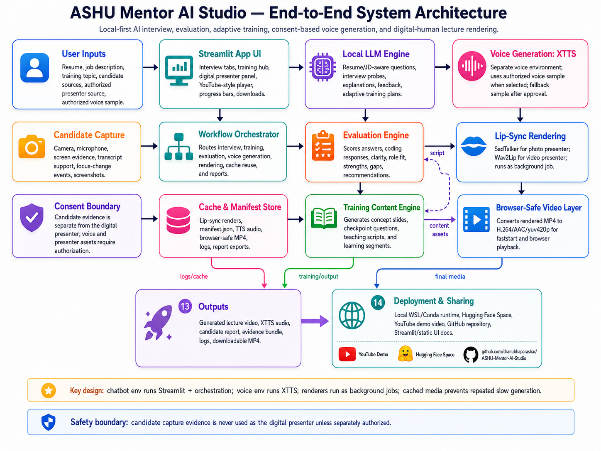
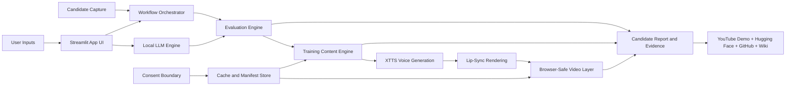
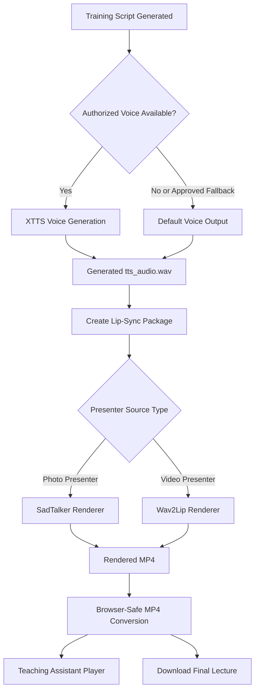

> **ASHU Mentor AI Studio** — **Adaptive Smart Human-like Unit Mentor AI Studio** — is an end-to-end AI mentor platform that moves beyond simple mock interviews. It reads a candidate profile, understands the target role, asks structured questions, evaluates responses, identifies learning gaps, recommends personalized training, and can convert training content into a digital-human lecture with consent-aware voice and lip-sync generation.

::github{repo="dranubhaparashar/ASHU-Mentor-AI-Studio"}

---

> Demo and live app: [YouTube Demo](https://www.youtube.com/watch?v=2XXnTbtjREs) · [Hugging Face Space](https://huggingface.co/spaces/AnubhaParashar/ASHU)
>
> Wiki documentation: [Home](https://github.com/dranubhaparashar/ASHU-Mentor-AI-Studio/wiki) · [Demo & Live App](https://github.com/dranubhaparashar/ASHU-Mentor-AI-Studio/wiki/Demo-and-Live-App) · [Architecture & Product Design](https://github.com/dranubhaparashar/ASHU-Mentor-AI-Studio/wiki/Architecture-and-Product-Design) · [Complete Technical Specification](https://github.com/dranubhaparashar/ASHU-Mentor-AI-Studio/wiki/Complete-Technical-Specification) · [Training & Interview Workflow](https://github.com/dranubhaparashar/ASHU-Mentor-AI-Studio/wiki/Training-and-Interview-Workflow)
>
> Governance and evidence: [Digital Presenter Voice & Lip-Sync Pipeline](https://github.com/dranubhaparashar/ASHU-Mentor-AI-Studio/wiki/Digital-Presenter-Voice-and-Lip-Sync-Pipeline) · [Evidence Pack & Reporting](https://github.com/dranubhaparashar/ASHU-Mentor-AI-Studio/wiki/Evidence-Pack-and-Reporting) · [Security, Consent & Governance](https://github.com/dranubhaparashar/ASHU-Mentor-AI-Studio/wiki/Security-Consent-and-Governance)

---

## Demo Video

<iframe
  width="100%"
  height="420"
  src="https://www.youtube.com/embed/2XXnTbtjREs"
  title="ASHU Mentor AI Studio Demo"
  frameBorder="0"
  allow="accelerometer; autoplay; clipboard-write; encrypted-media; gyroscope; picture-in-picture; web-share"
  allowFullScreen>
</iframe>

---

## One-Line Idea

**ASHU Mentor AI Studio turns a resume, job description, training topic, and candidate interaction into a complete AI mentoring cycle: interview → evaluation → learning gaps → adaptive training → digital-human lecture → evidence-backed report.**

Most interview tools stop at question generation. ASHU Mentor AI Studio is designed as a complete workflow platform where assessment, training, generated media, and documentation remain connected.

---

## Why This Project Exists

Interview preparation, candidate screening, and technical training are usually fragmented across multiple tools:

- one tool generates questions,
- another records candidate answers,
- another gives generic feedback,
- another prepares training material,
- and a completely separate pipeline is needed to create voice or video-based learning content.

Career preparation is fragmented across separate interview, resume, coaching, voice, and training tools. A system may ask questions, but it rarely converts answer quality into a meaningful training pathway. It may generate lessons, but the lessons are not always linked to the candidate’s actual weaknesses. It may create videos, but the video generation workflow is often disconnected from consent, evidence, and evaluation.

**ASHU Mentor AI Studio solves this by joining the full chain into one local-first AI mentor studio.**

---

## Project at a Glance

| Area | Description |
|---|---|
| **Full Form** | Adaptive Smart Human-like Unit Mentor AI Studio |
| **Primary Goal** | Build an AI mentor that can conduct structured interviews, evaluate answers, recommend training, and generate digital-human teaching content. |
| **Main Users** | Students, job seekers, interview coaches, training teams, educators, HR reviewers, AI product demonstrators. |
| **Core Interface** | Streamlit dashboard with interview, evaluation, training, digital presenter, media, and report modules. |
| **AI Layer** | Local LLM orchestration for question generation, evaluation reasoning, training scripts, and feedback. |
| **Media Layer** | XTTS/Coqui voice generation, SadTalker/Wav2Lip lip-sync, FFmpeg browser-safe MP4 conversion. |
| **Evidence Layer** | Reports, transcripts, scores, logs, generated media manifest, and candidate evidence bundle. |
| **Deployment Surface** | GitHub repository, Hugging Face Space, YouTube demo, and GitHub Wiki documentation. |
| **Design Principle** | Candidate evidence and presenter assets are separated through explicit consent boundaries. |

---

## What Makes ASHU Different

> [!IMPORTANT]
> ASHU Mentor AI Studio is not just an LLM wrapper. It is a connected workflow where each output becomes useful for the next stage.

| Ordinary Tool | ASHU Mentor AI Studio |
|---|---|
| Generates generic interview questions | Generates resume-aware and JD-aware questions |
| Gives basic feedback | Produces structured score, role-fit reasoning, and learning-gap analysis |
| Ends after mock interview | Converts weak areas into adaptive training modules |
| Produces static text | Can generate digital-human lecture output |
| Treats media generation separately | Connects training script, voice, lip-sync, cache, and final MP4 playback |
| Lacks evidence structure | Exports candidate reports, transcripts, logs, scores, and media manifests |
| Ignores consent boundaries | Separates candidate evidence, presenter source, and authorized voice assets |

---

## Reader Walkthrough

A reader reviewing this project can understand it in four steps:

1. **Input** — upload or paste a resume, job description, candidate details, and training topic.
2. **Interview** — the system generates structured role-aware questions and captures candidate responses.
3. **Evaluation** — answers are scored with strengths, weaknesses, role fit, readiness, and learning gaps.
4. **Training Output** — the platform converts gaps into learning material and can render a digital-human teaching video.

The result is not only a score. It is a complete learning and evidence package.

---

## System Architecture



ASHU Mentor AI Studio follows a **local-first, consent-aware, multi-stage architecture**. The platform starts from user inputs such as a resume, job description, training topic, candidate answers, and optional presenter or voice assets. The Streamlit interface routes these inputs into the workflow orchestrator, which coordinates LLM reasoning, evaluation, training generation, media creation, caching, and report export.

The architecture has four major boundaries:

1. **Candidate boundary** — candidate responses, transcript, scores, and interview evidence are used for assessment and feedback.
2. **Presenter boundary** — presenter image or video is used only for digital-human rendering when explicitly authorized.
3. **Voice boundary** — XTTS voice generation requires an authorized voice sample or approved fallback voice.
4. **Deployment boundary** — heavy media rendering works best locally, while Hugging Face provides a public demo surface.



---

## End-to-End Workflow

| Stage | What Happens | Output |
|---|---|---|
| **1. Setup** | User provides resume, job description, topic, role, difficulty, and optional presenter/voice assets. | Structured candidate and training context |
| **2. Question Generation** | LLM generates resume-aware, JD-aware, technical, behavioral, and coding questions. | Interview question set |
| **3. Candidate Capture** | Candidate answers are captured with optional transcript and evidence metadata. | Candidate response record |
| **4. Evaluation** | Evaluation engine scores answer quality, clarity, role fit, confidence, and readiness. | Scorecard, strengths, weaknesses |
| **5. Gap Analysis** | Weak areas are converted into learning objectives. | Personalized training gaps |
| **6. Training Plan** | Training content engine creates modules, explanations, checkpoints, and scripts. | Adaptive training plan |
| **7. Voice Generation** | XTTS/Coqui generates speech from authorized voice or approved fallback. | Teaching audio file |
| **8. Lip-Sync Rendering** | SadTalker or Wav2Lip generates digital-human lecture video. | Rendered MP4 |
| **9. Browser-Safe Conversion** | FFmpeg converts output to reliable browser playback format. | H.264/AAC MP4 |
| **10. Evidence Export** | Reports, transcripts, scores, logs, and media manifest are packaged. | Evidence bundle |

---

## Core Modules

### 1. Interview Intelligence

The interview engine uses the candidate resume and job description to produce targeted questions. Instead of generic prompts, it can focus on role expectations, project history, technical skills, behavioral readiness, and coding-style reasoning.

### 2. Evaluation Engine

The evaluation module scores responses and explains the reasoning behind the score. It can summarize strengths, identify weak areas, and convert gaps into actionable learning tasks.

### 3. Adaptive Training Planner

The training planner converts interview weaknesses into modules, explanations, checkpoint questions, and a teaching script. This makes the system useful not only for screening but also for improvement.

### 4. Digital Presenter Pipeline

The digital presenter layer connects generated teaching scripts with voice synthesis and lip-sync rendering. This allows the system to create a teaching assistant experience rather than only producing text.

### 5. Evidence Pack Generator

The evidence layer makes the workflow auditable. It can export transcripts, evaluation summaries, JSON score records, training plans, generated audio/video manifests, and logs.

---

## Digital Presenter Voice and Lip-Sync Pipeline

The digital presenter workflow is intentionally separated from the interview workflow. Candidate evidence should not automatically become presenter media. Presenter image/video and voice samples are separate assets and require explicit authorization.



> [!WARNING]
> Candidate face, voice, or identity should not be reused as digital presenter material unless the user has explicitly provided separate consent for that purpose.

---

## Dashboard Experience

| Dashboard Area | Reader Value |
|---|---|
| **Interview Setup** | Shows how resume, JD, role, and difficulty are configured. |
| **Interview Session** | Demonstrates question generation and response capture. |
| **Coding Round** | Supports technical or coding-style evaluation. |
| **Evaluation Dashboard** | Provides score, strengths, weaknesses, and readiness summary. |
| **Training Hub** | Converts gaps into personalized lessons and practice checkpoints. |
| **Digital Presenter** | Shows generated teaching script, voice options, presenter selection, and video preview. |
| **Media Player** | Plays generated browser-safe MP4 lectures. |
| **Report Downloads** | Allows export of candidate feedback, evidence, transcripts, and generated outputs. |
| **Architecture Docs** | Documents the complete workflow inside the app for reviewers. |

---

## Evidence Pack Structure

A strong AI system should not only produce an answer. It should also produce evidence. ASHU Mentor AI Studio is designed to package outputs for review, reproducibility, and demonstration.

```text title="report_exports"
report_exports/
  candidate_report_<timestamp>.md
  candidate_report_<timestamp>.json
  transcript_<timestamp>.txt
  interview_scores_<timestamp>.json
  training_plan_<timestamp>.md
  generated_teaching_script_<timestamp>.txt
  media_manifest_<timestamp>.json
  generated_audio/
    tts_audio.wav
  generated_video/
    final_lecture_browser_safe.mp4
  logs/
    app_log.txt
    voice_generation_log.txt
    lipsync_render_log.txt
```

The evidence package supports:

- candidate readiness review,
- technical interview coaching,
- learning-gap tracking,
- training recommendation,
- generated lecture replay,
- consent audit for presenter and voice assets,
- project demonstration through GitHub, Hugging Face, and YouTube.

---

## Safety and Governance Model

| Area | Safety Behavior |
|---|---|
| **Candidate capture** | Used only for interview evidence, evaluation, and reporting. |
| **Presenter source** | Must be separately authorized before digital-human rendering. |
| **Voice sample** | XTTS voice generation must use an authorized sample or approved fallback. |
| **Candidate identity** | Candidate face/voice is not reused as presenter unless separately authorized. |
| **Fallback audio** | Automated fallback voice requires user approval. |
| **Generated media** | Final lecture output is labeled as generated training content. |
| **Reports** | Candidate reports are evidence-backed and should not be treated as final hiring decisions without human review. |
| **Deployment** | Public demo surfaces should avoid private candidate data and unauthorized voice/presenter assets. |

> **Candidate evidence is for evaluation. Presenter assets are for generated teaching. The two should never be mixed without explicit authorization.**

---

## Runtime Example

```bash title="run-locally.sh"
# Clone the repository
git clone https://github.com/dranubhaparashar/ASHU-Mentor-AI-Studio.git
cd ASHU-Mentor-AI-Studio

# Activate the main app environment
conda activate chatbot

# Run the dashboard
ASHU_VOICE_ENV=voice \
COQUI_TOS_AGREED=1 \
PYTHONNOUSERSITE=1 \
python -m streamlit run app.py --server.fileWatcherType none
```

For voice environment validation:

```bash title="validate-voice-env.sh"
conda activate voice

PYTHONNOUSERSITE=1 python -c "import numpy, scipy, torch; print('numpy', numpy.__version__); print('scipy', scipy.__version__); print('torch', torch.__version__)"

COQUI_TOS_AGREED=1 PYTHONNOUSERSITE=1 python -c "from TTS.api import TTS; TTS('tts_models/multilingual/multi-dataset/xtts_v2'); print('XTTS model load OK')"
```

---

## Hugging Face Space Deployment

For Hugging Face deployment, keep the Space configuration at the top of `README.md` and keep `requirements.txt` as a clean package list.

```yaml title="README.md Space Header"
---
title: ASHU Mentor AI Studio
emoji: 🎓
colorFrom: blue
colorTo: indigo
sdk: streamlit
sdk_version: "1.25.0"
app_file: app.py
pinned: false
---
```

The Hugging Face Space is useful for public UI demonstration, project showcasing, and live walkthroughs. Full local voice cloning, private file paths, and heavy lip-sync rendering may work better in local WSL/Conda environments.

---

## Public Demo Surfaces

| Surface | Purpose |
|---|---|
| [Live Hugging Face App](https://huggingface.co/spaces/AnubhaParashar/ASHU) | Public browser-based demo of the Streamlit interface. |
| [YouTube Demo](https://www.youtube.com/watch?v=2XXnTbtjREs) | Walkthrough for reviewers, recruiters, collaborators, and readers. |
| [dranubhaparashar / ASHU-Mentor-AI-Studio](https://github.com/dranubhaparashar/ASHU-Mentor-AI-Studio) | Source code, app structure, technical assets, and deployment instructions. |
| [GitHub Wiki Home](https://github.com/dranubhaparashar/ASHU-Mentor-AI-Studio/wiki) | Architecture, technical specification, security governance, and user documentation. |

---

## Project Links

[dranubhaparashar / ASHU-Mentor-AI-Studio](https://github.com/dranubhaparashar/ASHU-Mentor-AI-Studio)

- **Live App:** [ASHU Mentor AI Studio on Hugging Face Spaces](https://huggingface.co/spaces/AnubhaParashar/ASHU)
- **Demo Video:** [ASHU Mentor AI Studio YouTube Demo](https://www.youtube.com/watch?v=2XXnTbtjREs)
- **Wiki Home:** [ASHU Mentor AI Studio Wiki](https://github.com/dranubhaparashar/ASHU-Mentor-AI-Studio/wiki)
- **Demo & Live App:** [Demo and deployment links](https://github.com/dranubhaparashar/ASHU-Mentor-AI-Studio/wiki/Demo-and-Live-App)
- **Architecture:** [Architecture & Product Design](https://github.com/dranubhaparashar/ASHU-Mentor-AI-Studio/wiki/Architecture-and-Product-Design)
- **Technical Specification:** [Complete Technical Specification](https://github.com/dranubhaparashar/ASHU-Mentor-AI-Studio/wiki/Complete-Technical-Specification)
- **Training Workflow:** [Training and Interview Workflow](https://github.com/dranubhaparashar/ASHU-Mentor-AI-Studio/wiki/Training-and-Interview-Workflow)
- **Digital Presenter Pipeline:** [Digital Presenter Voice and Lip-Sync Pipeline](https://github.com/dranubhaparashar/ASHU-Mentor-AI-Studio/wiki/Digital-Presenter-Voice-and-Lip-Sync-Pipeline)
- **Security and Consent:** [Security, Consent and Governance](https://github.com/dranubhaparashar/ASHU-Mentor-AI-Studio/wiki/Security-Consent-and-Governance)

---

## Documentation and Wiki Links

| Wiki Page | Purpose |
|---|---|
| [Home](https://github.com/dranubhaparashar/ASHU-Mentor-AI-Studio/wiki) | Main entry point for the project wiki. |
| [About ASHU Mentor AI Studio](https://github.com/dranubhaparashar/ASHU-Mentor-AI-Studio/wiki/About-ASHU-Mentor-AI-Studio) | Short overview, motivation, and project positioning. |
| [Demo & Live App](https://github.com/dranubhaparashar/ASHU-Mentor-AI-Studio/wiki/Demo-and-Live-App) | YouTube demo, Hugging Face app, and public walkthrough links. |
| [Architecture & Product Design](https://github.com/dranubhaparashar/ASHU-Mentor-AI-Studio/wiki/Architecture-and-Product-Design) | System design, runtime layers, and environment separation. |
| [Complete Technical Specification](https://github.com/dranubhaparashar/ASHU-Mentor-AI-Studio/wiki/Complete-Technical-Specification) | Full technical design and implementation reference. |
| [Training & Interview Workflow](https://github.com/dranubhaparashar/ASHU-Mentor-AI-Studio/wiki/Training-and-Interview-Workflow) | End-to-end interview, evaluation, and adaptive training flow. |
| [Digital Presenter Voice & Lip-Sync Pipeline](https://github.com/dranubhaparashar/ASHU-Mentor-AI-Studio/wiki/Digital-Presenter-Voice-and-Lip-Sync-Pipeline) | Voice generation, presenter assets, and video rendering pipeline. |
| [Background Rendering & Cache Reuse](https://github.com/dranubhaparashar/ASHU-Mentor-AI-Studio/wiki/Background-Rendering-and-Cache-Reuse) | Prefetching, cache reuse, and faster demo execution. |
| [Feature Reference](https://github.com/dranubhaparashar/ASHU-Mentor-AI-Studio/wiki/Feature-Reference) | Feature-by-feature explanation for readers and reviewers. |
| [Acceptance Criteria Mapping](https://github.com/dranubhaparashar/ASHU-Mentor-AI-Studio/wiki/Acceptance-Criteria-Mapping) | How implemented modules map to expected functionality. |
| [Evidence Pack & Reporting](https://github.com/dranubhaparashar/ASHU-Mentor-AI-Studio/wiki/Evidence-Pack-and-Reporting) | Reports, transcripts, scores, logs, and exported evidence bundle. |
| [Security, Consent & Governance](https://github.com/dranubhaparashar/ASHU-Mentor-AI-Studio/wiki/Security-Consent-and-Governance) | Candidate evidence, voice authorization, presenter consent, and safety boundaries. |
| [Quick Links](https://github.com/dranubhaparashar/ASHU-Mentor-AI-Studio/wiki/Quick-Links) | Fast navigation page for repository, wiki, demo, and app links. |
| [GitHub Wiki Upload Instructions](https://github.com/dranubhaparashar/ASHU-Mentor-AI-Studio/wiki/GitHub-Wiki-Upload-Instructions) | Instructions for maintaining or uploading wiki pages. |

---

## Practical Use Cases

| User Group | How ASHU Helps |
|---|---|
| **Students** | Practice interviews based on their own resume and target job. |
| **Job Seekers** | Identify role gaps and receive adaptive learning recommendations. |
| **Interview Coaches** | Use structured evidence to guide candidate improvement. |
| **Educators** | Convert topics into AI-generated teaching scripts and digital lectures. |
| **HR Teams** | Support pre-screening workflows with human review and evidence-backed reports. |
| **AI Researchers** | Explore combined LLM reasoning, evaluation, voice synthesis, lip-sync, and governance. |
| **Product Demonstrators** | Showcase an end-to-end GenAI workflow with app, demo, code, wiki, and video. |

---

## Engineering Value

ASHU Mentor AI Studio demonstrates how multiple AI capabilities can be connected into one practical system:

- **LLM orchestration** for interview and training generation,
- **evaluation logic** for answer scoring and readiness analysis,
- **adaptive training** for personalized learning paths,
- **voice generation** using XTTS/Coqui,
- **lip-sync rendering** using SadTalker or Wav2Lip,
- **browser-safe media conversion** using FFmpeg,
- **evidence export** for reports, transcripts, logs, and media manifests,
- **public demo readiness** through Hugging Face, YouTube, GitHub, and Wiki documentation.

It is designed to be measurable, explainable, adaptive, auditable, consent-aware, and demo-ready.

---

## Current Strengths

- Complete interview-to-training workflow instead of isolated question generation.
- Resume-aware and JD-aware questioning for personalized interview preparation.
- Candidate response scoring with strengths, weaknesses, and readiness summary.
- Adaptive training plan generation from actual learning gaps.
- Digital-human lecture generation using voice and lip-sync pipelines.
- Cached media reuse for smoother demonstrations.
- Evidence pack export for review and reproducibility.
- Public project surface through GitHub, Hugging Face, YouTube, and Wiki.

---

## Next Improvements

- Stabilize Hugging Face deployment for more reliable public access.
- Add role-specific rubrics for software, data science, AI, product, and management roles.
- Add exportable PDF reports for candidate feedback and training plans.
- Add structured coding-round scoring with test cases and explanations.
- Add a consent checklist UI before voice or presenter rendering.
- Add model-provider abstraction for local LLMs, OpenAI, Azure OpenAI, and Gemini.
- Add dashboard-level evidence pack export for demo and review workflows.
- Add transcript alignment for generated lecture videos.
- Add analytics for comparing candidate progress across multiple interview attempts.

---

## Key Innovation

> [!IMPORTANT]
> The strongest innovation is not one model or one screen. The innovation is the complete connected pipeline: **resume-aware interview → JD-aware evaluation → learning-gap analysis → adaptive training → voice generation → lip-sync rendering → browser-safe video → evidence-backed report**.

Most tools handle these steps separately. ASHU Mentor AI Studio connects them into one workflow so that the reader can see a complete AI product idea, not only a prototype screen.

---

## Conclusion

ASHU Mentor AI Studio shows how interview preparation and training can evolve from disconnected tools into an end-to-end AI mentoring platform.

It combines structured interview intelligence, explainable evaluation, personalized learning, consent-aware media generation, and public demo documentation into one integrated system.

The result is a practical AI mentor studio for users who need more than mock questions. It supports assessment, improvement, teaching, demonstration, and evidence-backed review in one workflow.

---

## Final Thought

> From **interview practice** to **adaptive digital-human training**.
>
> The real value is not only asking better questions. It is connecting questions, answers, evaluation, learning gaps, teaching scripts, generated voice, rendered video, and evidence-backed reports into one explainable AI workflow.
>
> **Resume-aware interview · JD-aware evaluation · candidate evidence · adaptive training · consent-based voice · digital-human lecture · GitHub + Hugging Face + YouTube demo surface**
