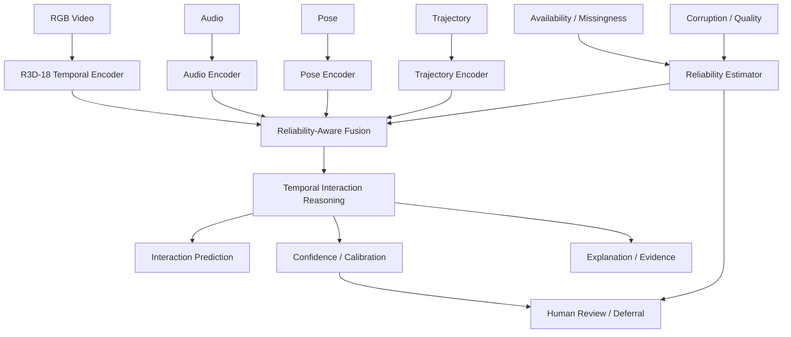
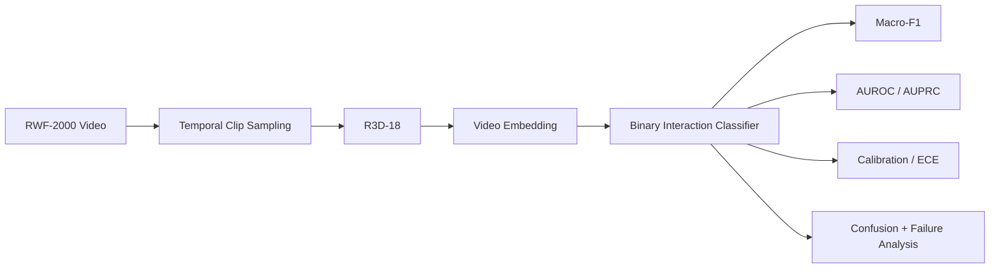
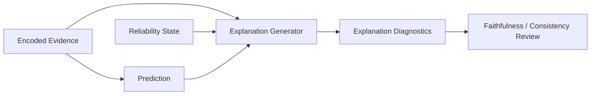

> **CARE-SIU** stands for **Context-Aware, Reliability-Calibrated, and Explainable Multimodal Social-Interaction Understanding for Safety-Critical Environments**.

CARE-SIU is a research project built around a simple idea:

> A safety-critical AI system should not only predict *what is happening*. It should also communicate **how reliable the evidence is, how confident the decision should be, what evidence influenced the output, and when the system should defer to human review**.

The project combines temporal video understanding, multimodal reasoning, reliability calibration, explainability, synthetic-to-real transfer, federated and continual-learning experiments, edge export, and explicit data-leakage auditing inside one reproducible research pipeline.

---

## Project Links

- **GitHub:** https://github.com/dranubhaparashar/CARE-SIU
- **Architecture:** https://github.com/dranubhaparashar/CARE-SIU/wiki/Architecture
- **Results:** https://github.com/dranubhaparashar/CARE-SIU/wiki/Results
- **Research Integrity:** https://github.com/dranubhaparashar/CARE-SIU/wiki/Research-Integrity-and-Leakage-Audit

---

## One-Line Idea

**CARE-SIU learns temporal and multimodal interaction representations while explicitly modeling evidence reliability, calibration, explainability, missing modalities, and evaluation integrity.**

---

## Why This Project Exists

Safety-critical social-interaction understanding is not only a recognition problem. Real systems must operate with incomplete observations, corrupted evidence, uncertain predictions, domain shift, missing modalities, calibration error, and the possibility that an apparently strong benchmark contains hidden shortcuts.

CARE-SIU therefore asks a broader question:

> Can an interaction-understanding system predict accurately while also exposing uncertainty, evidence quality, explanation quality, and the limits of its own evaluation?

---

## Project at a Glance

| Item | Description |
|---|---|
| **Project Type** | Self research project |
| **Primary Domain** | Multimodal social-interaction understanding |
| **Main Real-Data Encoder** | R3D-18 temporal video model |
| **Modalities** | RGB, audio, pose, trajectory |
| **Reliability Focus** | Missingness, corruption, confidence, calibration |
| **Explainability** | Evidence generation and explanation diagnostics |
| **Transfer Study** | Synthetic → real temporal transfer |
| **Additional Branches** | Federated learning, continual learning, edge export |
| **Primary Real Benchmark** | RWF-2000 |
| **Framework** | PyTorch / torchvision |
| **Experiment Seeds** | 1, 7, 21, 42, 84 |

---

## System Architecture



The broader multimodal architecture is intentionally separated from the currently strongest validated real-data path.

---

## Validated Real-Data Path



---

## Main Result: Temporal Modeling Matters

The earlier five-seed real-only baseline achieved:

**0.6661 ± 0.0067 macro-F1**

After moving to temporal R3D-18 embeddings, the five-seed real-only result improved to:

**0.8134 ± 0.0121 macro-F1**

That is approximately **+0.1473 absolute macro-F1** over the earlier baseline.

### Five-seed comparison

| Seed | Real-Only | Synthetic → Real | Delta |
|---:|---:|---:|---:|
| 1 | 0.8225 | 0.8018 | -0.0207 |
| 7 | 0.8274 | 0.7947 | -0.0327 |
| 21 | 0.8023 | 0.8098 | +0.0075 |
| 42 | 0.8150 | 0.8149 | -0.00003 |
| 84 | 0.7998 | 0.8098 | +0.0100 |

| Condition | Macro-F1 |
|---|---:|
| **Temporal R3D-18 real-only** | **0.8134 ± 0.0121** |
| Temporal synthetic → real | **0.8062 ± 0.0080** |

---

## Synthetic-to-Real Transfer: Negative Result

Synthetic pretraining did **not** improve average real-world classification performance.

| Statistic | Result |
|---|---:|
| Mean macro-F1 delta | **-0.0072** |
| Median delta | approximately **-0.00003** |
| Seeds improved | **2 / 5** |
| Paired t-test | **p = 0.4383** |
| Wilcoxon signed-rank | **p = 0.6250** |

The result does not support a classification-performance claim for synthetic pretraining under the completed protocol.

---

## Reliability and Calibration

| Metric | Real-Only | Synthetic → Real |
|---|---:|---:|
| ECE ↓ | ~0.1237 | **~0.1164** |
| AUROC ↑ | **~0.8940** | ~0.8901 |
| AUPRC ↑ | ~0.900 | ~0.900 |

Synthetic transfer produced a small calibration improvement even though it did not improve classification macro-F1.

---

## Reliability-Aware Multimodal Reasoning

For modality \(m\):

\[
z_m = E_m(x_m)
\]

and a generic reliability-aware fusion layer can combine modality representations as:

\[
z = \sum_m lpha_m z_m
\]

with:

\[
lpha_m =
\frac{a_m \exp(r_m)}
{\sum_j a_j \exp(r_j)}
\]

where \(a_m\) indicates availability and \(r_m\) represents estimated modality reliability.

The design goal is that missing or corrupted evidence should not receive the same influence as clean evidence.

---

## The Most Important Research-Integrity Finding

The original 10,000-clip CARE-Synth-XL dataset produced near-perfect pose and trajectory ablation scores.

Instead of accepting those results, the underlying files were audited.

| Audit Item | Finding |
|---|---:|
| Dataset rows | 10,000 |
| Interaction labels | 24 |
| Unique pose file contents | **54** |
| Unique trajectory file contents | **50** |
| Combined pose/trajectory templates | **54** |
| Pose templates crossing splits | **54 / 54** |
| Trajectory templates crossing splits | **50 / 50** |
| Rows involved in pose cross-split duplication | **10,000 / 10,000** |
| Pose templates shared by multiple labels | **0** |

Most classes had only two pose templates.

This meant the model could identify a small class-specific motion template already seen in training. The perfect synthetic scores therefore represented **template memorization**, not generalization.

> **Unique sample identifiers do not guarantee unique information.**

---

## Corrected Synthetic Evaluation Protocol

The redesigned pipeline requires:

- many independent motion templates per class,
- stable `template_id`,
- variant IDs,
- subject/body profiles,
- camera and environment profiles,
- independent motion and generation seeds,
- client/round assignment independent of class,
- template-disjoint train/validation/test splitting,
- file-content hashing before training.

```text
Template A -> train only
Template B -> validation only
Template C -> test only
```

All variants derived from one template must stay in the same split.

---

## Explainability



CARE-SIU separates explanation generation from explanation evaluation. A plausible-looking explanation is not automatically treated as faithful.

---

## Additional Research Branches

### Federated Learning

Client-partitioned experiments study distributed model learning while explicitly guarding against client identity becoming a hidden label shortcut.

### Continual Learning

Round-ordered experiments study how model behavior changes as the interaction distribution evolves over time.

### Edge Export

TorchScript export and runtime benchmarking study deployment feasibility separately from predictive validity.

---

## Reproducibility Pipeline

```text
01  Generate synthetic data
02  Download / prepare datasets
03  Build manifests
04  Train baseline
05  Evaluate
06  Run pipeline
07  Federated learning
08  Continual learning
09  Edge export
10  Explain sample
11  Combine manifests
12  Synthetic-to-real benchmark
13  Repair synthetic data
14  Stratify manifest
15  Extract temporal video embeddings
16  Run temporal transfer
17  Generate ablation manifests
18  Collect experiment results
19  Summarize explanations
20  Validate synthetic split integrity
```

The automated PowerShell runner reuses completion markers so completed stages can be skipped and interrupted work can resume.

---

## Technology Stack

| Layer | Technology |
|---|---|
| Language | Python |
| Deep Learning | PyTorch |
| Video Models | torchvision / R3D-18 |
| Computer Vision | OpenCV |
| Numerical Computing | NumPy |
| Data | pandas |
| ML Metrics | scikit-learn |
| Statistical Tests | SciPy |
| Model Export | TorchScript |
| Automation | PowerShell |
| Reporting | CSV / JSON / HTML |
| Version Control | Git / GitHub |

---

## What Makes CARE-SIU Different

Many interaction-recognition systems stop at:

```text
Video -> Classifier -> Accuracy
```

CARE-SIU expands the question to:

```text
Evidence
   ↓
Temporal + Multimodal Representation
   ↓
Evidence Reliability
   ↓
Prediction
   ├── Confidence
   ├── Calibration
   ├── Explanation
   ├── Failure Analysis
   └── Human Review / Deferral
```

The project also treats **evaluation integrity** as part of the AI system itself.

---

## What Is Currently Supported

### Supported by completed evidence

- temporal R3D-18 representations substantially improve the real-only benchmark over the earlier weaker representation;
- five-seed temporal real-data performance is stable around macro-F1 0.81;
- current synthetic pretraining does not provide a statistically supported classification gain;
- calibration can change independently of classification performance;
- the original synthetic generator contained severe cross-split motion-template leakage.

### Still under validation

- real-world multimodal superiority over RGB;
- leakage-controlled synthetic modality ablations;
- cross-dataset generalization;
- selective prediction under deployment shift;
- explanation faithfulness at larger scale;
- deployment-level safety guarantees.

---

## Current Research Direction

The next CARE-SIU stage focuses on:

1. leakage-controlled CARE-Synth-XL-v2 generation,
2. template-disjoint multimodal ablations,
3. a second independent real dataset,
4. missing-modality and corruption evaluation,
5. selective prediction and review coverage,
6. stronger explanation-faithfulness analysis,
7. external generalization.

---

## Research Integrity

CARE-SIU intentionally distinguishes:

- **implemented** vs **validated**,
- **synthetic sanity checks** vs **real-world evidence**,
- **positive results** vs **negative results**,
- **high scores** vs **trustworthy evaluation**.

That distinction is central to the project.

---

## Repository

**GitHub:** https://github.com/dranubhaparashar/CARE-SIU  
**Architecture:** https://github.com/dranubhaparashar/CARE-SIU/wiki/Architecture  
**Results:** https://github.com/dranubhaparashar/CARE-SIU/wiki/Results  
**Research Integrity:** https://github.com/dranubhaparashar/CARE-SIU/wiki/Research-Integrity-and-Leakage-Audit
