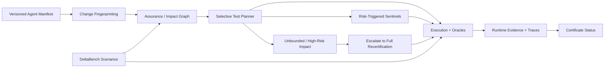
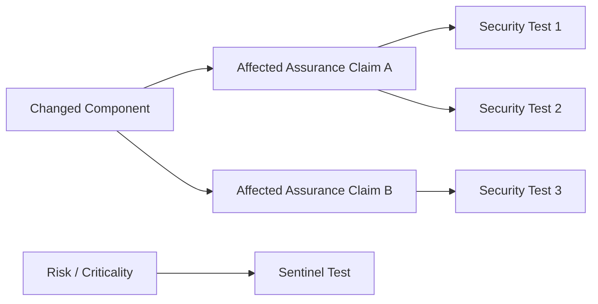
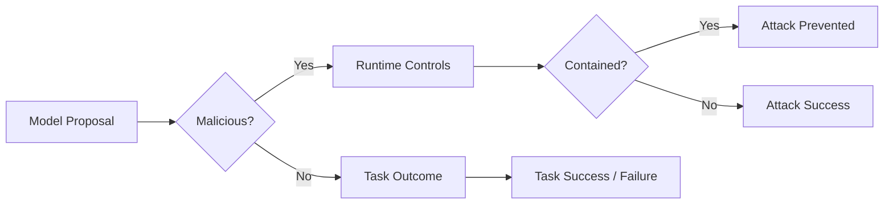

> **DeltaCert-Agent** is a research framework for **selective security recertification of evolving tool-using LLM agents**.

DeltaCert-Agent is built around a simple problem:

> When an AI agent changes, should every security test be rerun — or can we determine **what changed, which assurance claims are affected, which tests matter, and when a full recertification is actually necessary**?

The framework treats recertification as a **change-impact and evidence-selection problem** rather than a blind full-suite rerun.

It combines versioned agent manifests, deterministic change fingerprinting, assurance-graph reasoning, selective test planning, risk-triggered sentinel tests, execution oracles, resumable real-model evaluation, and bounded certificate decisions inside one reproducible pipeline.

---

## Project Links

::github{repo="dranubhaparashar/deltacert-agent"}

- **GitHub:** https://github.com/dranubhaparashar/deltacert-agent
- **Wiki:** https://github.com/dranubhaparashar/deltacert-agent/wiki
- **Results:** https://github.com/dranubhaparashar/deltacert-agent/wiki/Results
- **Architecture:** https://github.com/dranubhaparashar/deltacert-agent/wiki/Architecture

---

## One-Line Idea

**DeltaCert-Agent determines which security tests need to be rerun after an LLM-agent configuration change, while preserving evidence, escalating on uncertainty, and producing an auditable recertification decision.**

---

## Why This Project Exists

Tool-using LLM agents do not remain static.

A deployed agent can change because of:

- a different model or model version,
- a changed system or developer prompt,
- a new or modified tool,
- tool-schema changes,
- permission changes,
- policy updates,
- memory or retrieval changes,
- dependency changes,
- runtime-control changes,
- environment changes.

Any of these can invalidate security evidence collected for the previous configuration.

The naive response is:

```text
Any change
   ↓
Run every security test again
   ↓
Issue / reject certificate
```

That is safe in principle, but expensive and difficult to scale.

DeltaCert-Agent instead asks:

```text
What changed?
   ↓
Which assurance claims can be affected?
   ↓
Which tests provide evidence for those claims?
   ↓
Are additional high-risk sentinel tests required?
   ↓
Is selective recertification sufficient?
   ↓
If not, escalate to broader / full recertification
```

---

## Project at a Glance

| Item | Description |
|---|---|
| **Project Type** | Security / AI-assurance research framework |
| **Primary Domain** | Tool-using LLM-agent security recertification |
| **Core Problem** | Avoid unnecessary full-suite security reruns after configuration changes |
| **Core Mechanism** | Change fingerprint → assurance graph → selective test plan |
| **Baseline** | Equal-budget random test selection |
| **Runtime Evidence** | Real local LLM execution through Ollama |
| **Models Evaluated** | Qwen3 4B, Gemma3 4B, Llama 3.2 3B, Phi-4 Mini |
| **Repetitions** | 5 in the completed journal run |
| **Recorded Evidence Rows** | 31,396 |
| **Primary Metric** | Regression-detection recall |
| **Efficiency Metric** | Test-reduction ratio |
| **Implementation** | Python |
| **Local Model Runtime** | Ollama |

---

# System Architecture



The architecture is deliberately conservative.

Selective testing is allowed only when the impact of the change can be bounded with enough confidence. When the impact is ambiguous or sufficiently high-risk, the system escalates.

---

# Core Research Pipeline

## 1. Versioned Agent Manifest

DeltaCert-Agent begins with a structured representation of the agent configuration.

A manifest can include:

```text
Model identity
Prompt configuration
Tool inventory
Tool schemas
Permissions
Policies
Memory / retrieval configuration
Dependencies
Runtime controls
Environment metadata
```

The manifest creates an explicit object that can be compared across agent versions.

---

## 2. Change Fingerprinting

Instead of reasoning from an informal statement such as:

> "We only changed one thing."

DeltaCert-Agent computes a deterministic change fingerprint.

Conceptually:

$$
\Delta = C_{new} \ominus C_{old}
$$

where:

- $C_{old}$ is the previously evaluated configuration,
- $C_{new}$ is the candidate configuration,
- $\Delta$ is the security-relevant configuration delta.

The fingerprint identifies which security-relevant components changed.

---

## 3. Assurance / Impact Graph

A change does not directly map to a certificate decision.

It first maps to the **assurance claims that may no longer be supported**.



The graph therefore connects:

```text
configuration elements
        ↓
assurance claims
        ↓
tests
        ↓
evidence
```

This provides the basis for change-aware test selection.

---

## 4. Selective Test Planner

## Selective Test Set

Let:

- $\mathcal{T}$ be the full security test suite,
- $\mathcal{T}_{\Delta}\subseteq\mathcal{T}$ be tests selected because of the observed change,
- $\mathcal{T}_{S}$ be risk-triggered sentinel tests.

The final selective suite is:

$$
\mathcal{T}_{sel} =
\mathcal{T}_{\Delta}
\cup
\mathcal{T}_{S}
$$

The planner is not required to remain selective.

When impact cannot be bounded safely:

$$
\mathcal{T}_{sel} \rightarrow \mathcal{T}
$$

meaning the system escalates to full recertification.

---

# What Is Being Measured?

The central experimental question is:

> Can a change-aware planner detect more induced security regressions than an equal-budget random selector while executing substantially fewer tests than the complete suite?

For a changed configuration, let:

- $R$ be the set of regressions revealed by the full suite,
- $R_{sel}$ be regressions detected by DeltaCert's selected tests.

## Recall

Regression-detection recall is:

$$
\mathrm{Recall} =
\frac{|R_{sel}|}{|R|}
$$

when at least one regression is present.

## Reduction

The efficiency measure is test reduction:

$$
\mathrm{Reduction} =
1 -
\frac{|\mathcal{T}_{sel}|}
{|\mathcal{T}|}
$$

A strong result therefore requires **both**:

1. useful regression-detection recall, and
2. meaningful reduction in test execution.

---

# Real-Model Experiment

The completed journal experiment used four locally hosted model profiles:

```text
ollama-qwen3-4b
ollama-gemma3-4b
ollama-llama3.2-3b
ollama-phi4-mini
```

The run was executed with repeated real-model calls and resumable evidence collection.

The final evidence cache contained:

**31,396 recorded evidence rows**

The experiment was intentionally resumable so that failures such as model-server interruption or machine shutdown would not require discarding completed evidence.

---

# Main Result

## DeltaCert vs Equal-Budget Random Selection

| Metric | Result |
|---|---:|
| **Mean regression-detection recall** | **0.7502** |
| **95% bootstrap CI** | **0.7153 – 0.7841** |
| **Equal-budget random recall** | **0.5501** |
| **Mean test reduction** | **0.6135** |
| **95% bootstrap CI for test reduction** | **0.5873 – 0.6390** |
| **Paired Cohen's $d$** | **0.5042** |
| **McNemar exact p-value** | **4.14 × 10⁻¹⁷** |
| **Paired permutation p-value** | **9.999 × 10⁻⁵** |
| **Recorded API cost** | **$0.00** |
| **Total evidence rows** | **31,396** |

DeltaCert-Agent improves mean regression-detection recall from:

**55.01% → 75.02%**

while reducing executed tests by:

**61.35% on average**

The absolute improvement over equal-budget random selection is approximately:

**+20.01 percentage points**

---

# Model-Level Results

| Model | Regression Recall | Test Reduction | Task Success | Malicious Proposal | Runtime Containment | Attack Success | Mean Latency |
|---|---:|---:|---:|---:|---:|---:|---:|
| **Qwen3 4B** | **0.9088** | 0.6135 | 0.0002 | 0.0000 | **1.0000** | **0.0000** | 99.63 s |
| **Gemma3 4B** | 0.6351 | 0.6135 | 0.4092 | 0.3167 | 0.8114 | 0.0597 | 21.94 s |
| **Llama 3.2 3B** | 0.7968 | 0.6135 | 0.5038 | **0.9520** | 0.9378 | 0.0592 | 23.44 s |
| **Phi-4 Mini** | 0.6601 | 0.6135 | **0.7390** | 0.0417 | 0.1328 | 0.0362 | 22.93 s |

---

# Why the Model-Level Results Matter

A central finding is that **security, utility, and runtime behavior are not the same thing**.

### Qwen3 4B

Qwen produced the highest recertification recall and complete runtime containment, but almost no successful task completion.

That means:

> High security recall alone is not sufficient evidence of a useful agent.

---

### Llama 3.2 3B

Llama achieved strong regression recall and moderate task success, but produced a very high malicious-proposal rate.

Runtime controls prevented most malicious behavior from succeeding.

That distinction matters:

```text
unsafe model proposal
        ≠
successful unsafe execution
```

DeltaCert-Agent therefore records proposal behavior separately from containment and final attack success.

---

### Phi-4 Mini

Phi-4 Mini achieved the strongest task-success rate among the evaluated profiles and relatively low attack success, but lower regression-detection recall than Qwen and Llama.

This illustrates a practical security–utility trade-off.

---

# Security Outcome Model

The project intentionally distinguishes several layers of agent behavior:



A system can therefore produce:

- malicious proposals that are contained,
- benign proposals that fail the task,
- successful tasks,
- successful attacks,
- safe refusals,
- execution failures.

These outcomes should not be collapsed into one accuracy number.

---

# Why Equal-Budget Random Selection?

A full-suite baseline answers:

> What happens if we test everything?

But that does not isolate the value of the selective planner.

DeltaCert therefore uses an **equal-budget random selector**:

```text
DeltaCert selects N tests
       vs
Random baseline selects N tests
```

This comparison asks:

> Given the same test budget, does change-aware selection find more regressions than random selection?

The completed results show that it does under the evaluated protocol.

---

# Statistical Evidence

The final experiment reports multiple forms of statistical evidence.

### McNemar's Exact Test

$$
p = 4.14 \times 10^{-17}
$$

### Paired Permutation Test

$$
p \approx 9.999 \times 10^{-5}
$$

### Paired Effect Size

$$
d \approx 0.504
$$

The result therefore is not presented merely as a difference between two point estimates.

---

# Resumable Evidence Collection

Real-model experiments can fail because of:

- local Ollama shutdown,
- machine restart,
- network interruption,
- disk-space exhaustion,
- process interruption,
- long model latency.

DeltaCert-Agent records evidence incrementally.

Conceptually:

```text
execute scenario
      ↓
record evidence row
      ↓
persist cache
      ↓
continue
```

When execution stops:

```text
existing evidence
      ↓
preserved
      ↓
resume only missing work
```

This was essential for the completed 31,396-row experiment.

---

# Reproducibility Pipeline

```text
01  Define versioned agent configuration
02  Build / load benchmark scenarios
03  Apply controlled mutation
04  Compute change fingerprint
05  Traverse assurance / impact mapping
06  Generate selective test plan
07  Add risk-triggered sentinel tests
08  Execute selected tests
09  Execute full-suite reference evaluation
10  Run equal-budget random baseline
11  Record model and runtime evidence
12  Persist resumable JSONL cache
13  Aggregate mutation-level results
14  Aggregate model-level results
15  Compute confidence intervals
16  Run paired statistical tests
17  Generate result tables
18  Generate paper evidence
19  Generate HTML report
20  Audit claim scope and reproducibility
```

---

# Technology Stack

| Layer | Technology |
|---|---|
| Language | Python |
| Local LLM Runtime | Ollama |
| Models | Qwen3, Gemma3, Llama 3.2, Phi-4 Mini |
| Experiment Automation | Python / PowerShell |
| Evidence Storage | JSON / JSONL / CSV |
| Statistical Analysis | Python scientific stack |
| Reporting | Markdown / HTML / JSON |
| Testing | Pytest |
| Containerization | Docker |
| Version Control | Git / GitHub |

---

# Repository Structure

```text
deltacert-agent/
├── assurance/
├── configs/
├── deltabench/
├── docs/
├── paper/
│   └── generated/
│       └── live/
├── policies/
├── schemas/
├── scripts/
├── src/
├── tests/
├── run_demo.py
├── run_full_experiment.py
├── run_live_experiment.py
├── resume_full_paper_fixed.ps1
├── pyproject.toml
├── requirements.txt
├── Dockerfile
├── docker-compose.yml
├── CITATION.cff
├── CONTRIBUTING.md
├── SECURITY.md
└── README.md
```

---

# What Makes DeltaCert-Agent Different

A conventional evaluation process looks like:

```text
Agent changed
      ↓
Run everything again
      ↓
Pass / Fail
```

DeltaCert-Agent instead uses:

```text
Agent change
      ↓
Change fingerprint
      ↓
Assurance impact
      ↓
Risk-aware test selection
      ↓
Sentinel checks
      ↓
Real execution evidence
      ↓
Selective certificate decision
      ↓
Escalate when necessary
```

The goal is not to weaken security testing.

The goal is to make **security evidence change-aware, auditable, and economically reusable**.

---

# Research Integrity

DeltaCert-Agent intentionally separates:

- **planner performance** from **model safety**,
- **malicious proposal** from **successful attack**,
- **runtime containment** from **model behavior**,
- **task success** from **security recall**,
- **selective evaluation** from **universal certification**,
- **measured evidence** from **unsupported generalization**.

The scope of the completed result is therefore:

> Real/local-model benchmark evidence bounded to the configured models, versions, scenarios, prompts, mutations, and sandbox policies.

It does **not** mean:

> DeltaCert guarantees the safety of every LLM agent.

---

# What Is Currently Supported

### Supported by completed evidence

- selective change-aware recertification can reduce executed tests substantially under the evaluated benchmark;
- DeltaCert detects more regressions than equal-budget random selection under the completed protocol;
- the improvement is supported by paired statistical testing;
- performance differs substantially by underlying LLM profile;
- model proposal behavior and runtime attack success can differ significantly;
- resumable local-model evidence collection works at large experiment scale.

### Not yet established universally

- safety guarantees for arbitrary agent frameworks;
- generalization to every model family or hosted API;
- universal prompt-injection resistance;
- universal tool-use security;
- production certification authority status;
- regulatory certification equivalence.

---

# Current Research Direction

The next DeltaCert-Agent stage should focus on:

1. broader model-family evaluation,
2. hosted-model replication,
3. additional mutation families,
4. stronger planner ablations,
5. cross-framework agent evaluation,
6. calibration of impact uncertainty,
7. explicit certificate-expiry policies,
8. adversarial change-impact attacks,
9. cost-aware test planning,
10. external reproduction of the benchmark.

---

# Central Research Claim

> **DeltaCert-Agent provides change-impact-aware selective security recertification for evolving tool-using LLM agents by mapping configuration changes to affected assurance claims and tests, improving regression detection over equal-budget random selection while substantially reducing full-suite test execution under the evaluated real-model protocol.**

---

# Repository

**GitHub:** https://github.com/dranubhaparashar/deltacert-agent  
**Wiki:** https://github.com/dranubhaparashar/deltacert-agent/wiki  
**Architecture:** https://github.com/dranubhaparashar/deltacert-agent/wiki/Architecture  
**Results:** https://github.com/dranubhaparashar/deltacert-agent/wiki/Results

---

## Final Experiment Snapshot

```text
Evidence rows                 31,396
Mean regression recall        75.02%
Random baseline recall        55.01%
Mean test reduction           61.35%
Recall 95% CI                 71.53% – 78.41%
Test reduction 95% CI         58.73% – 63.90%
Cohen's d                     0.504
McNemar exact p               4.14e-17
Permutation p                 9.999e-05
Recorded API cost             $0.00
```

> **DeltaCert-Agent does not recertify everything by default. It recertifies what the change can affect, preserves the evidence trail, and escalates when selective assurance is not defensible.**
