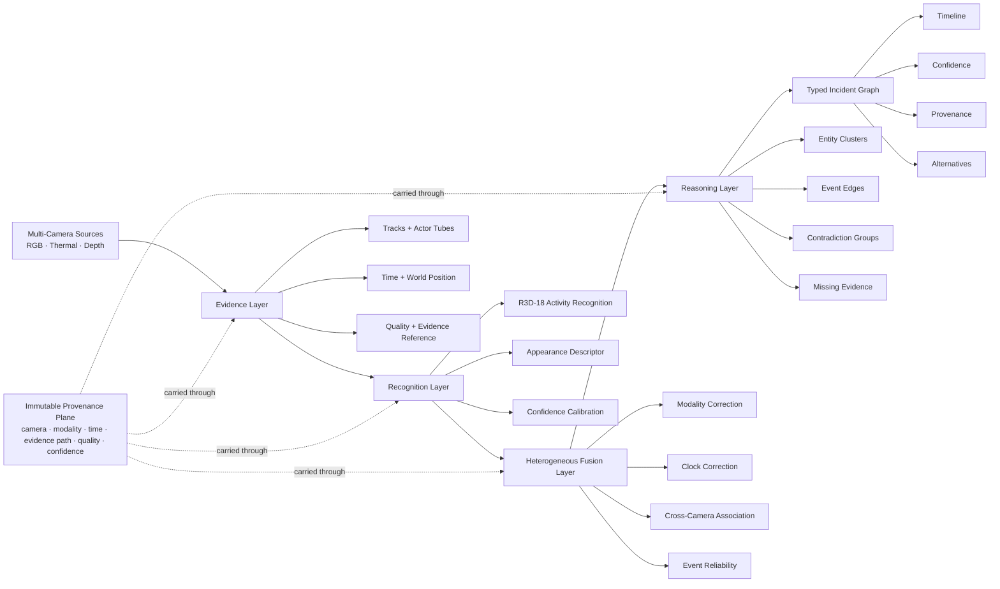
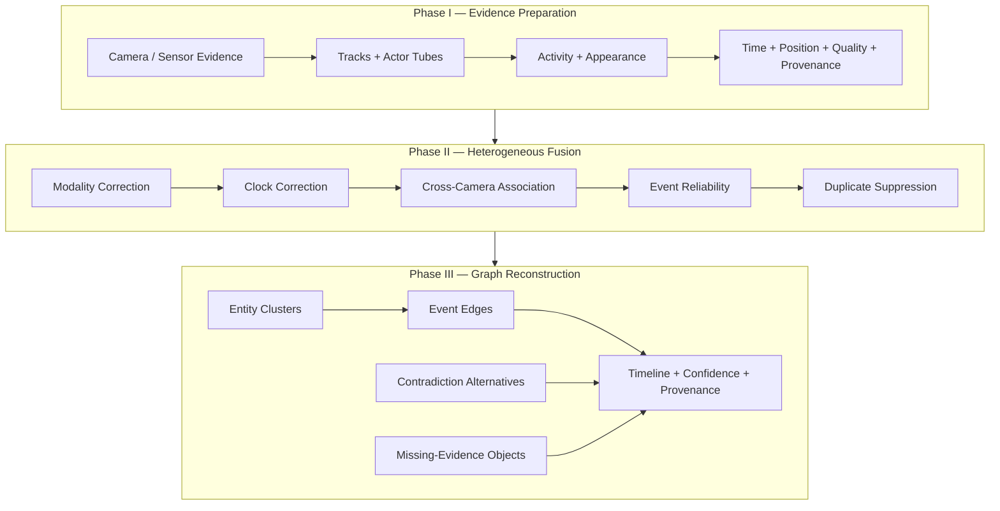
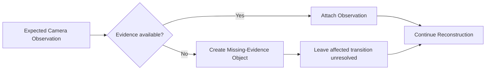
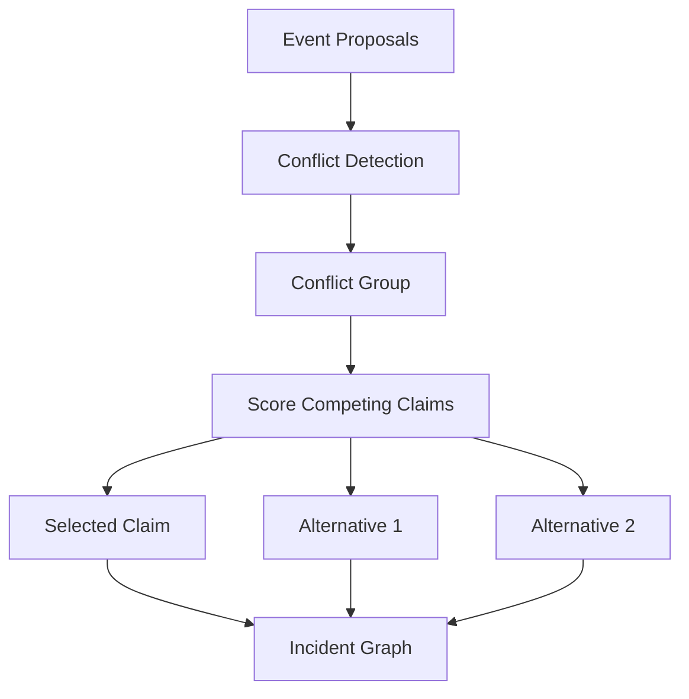
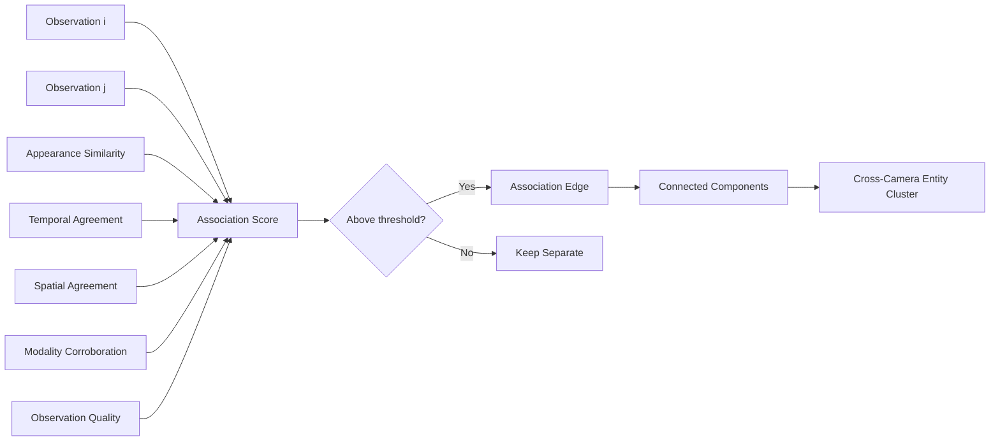
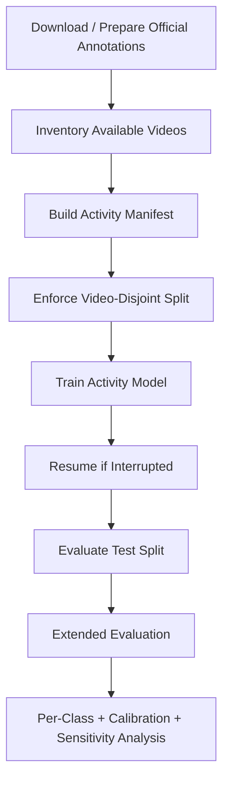
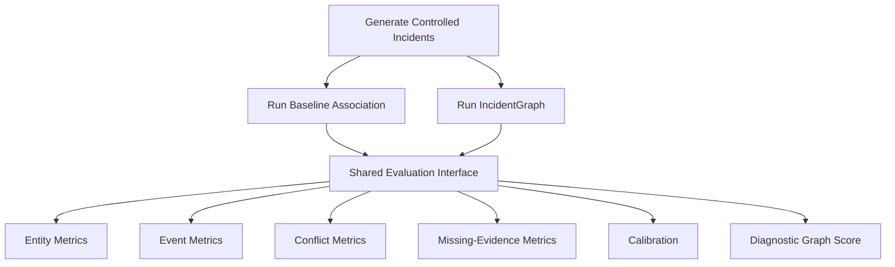
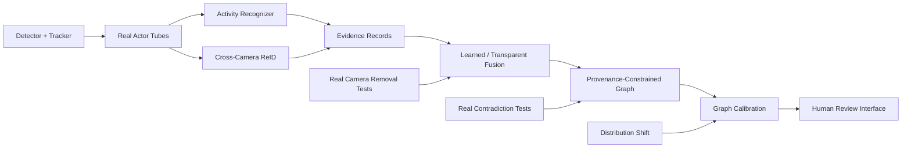

> **IncidentGraph** is a provenance-preserving heterogeneous evidence-fusion framework for uncertainty-aware multi-camera incident reconstruction. Instead of compressing asynchronous and incomplete camera evidence into one irreversible decision, it retains source evidence, confidence, contradictions, alternatives, missing observations, and cross-camera associations in an auditable typed graph.

::github{repo="dranubhaparashar/IncidentGraph"}

---

> **Wiki documentation:** [Home](https://github.com/dranubhaparashar/IncidentGraph/wiki) · [Architecture](https://github.com/dranubhaparashar/IncidentGraph/wiki/Architecture) · [Evidence Model](https://github.com/dranubhaparashar/IncidentGraph/wiki/Evidence-Model) · [Graph Reconstruction](https://github.com/dranubhaparashar/IncidentGraph/wiki/Graph-Reconstruction)
>
> **Experiments:** [Real MEVA Experiments](https://github.com/dranubhaparashar/IncidentGraph/wiki/Real-MEVA-Experiments) · [Synthetic Diagnostic](https://github.com/dranubhaparashar/IncidentGraph/wiki/Synthetic-Diagnostic) · [Reproducibility](https://github.com/dranubhaparashar/IncidentGraph/wiki/Reproducibility)
>
> **Claim boundary:** [Research Boundaries](https://github.com/dranubhaparashar/IncidentGraph/wiki/Research-Boundaries) · [Responsible Use](https://github.com/dranubhaparashar/IncidentGraph/wiki/Responsible-Use)

---

## One-Line Idea

IncidentGraph reconstructs multi-camera incidents without hiding **where evidence came from, which claims disagree, which observations are missing, and how uncertain the final reconstruction remains**.

The central design principle is:

> **Not observed is not the same as did not occur.**

And the central architectural principle is:

> **A fused conclusion should remain traceable to the observations that support it.**

---

## Why This Project Exists

Multi-camera pattern-recognition systems rarely receive perfectly aligned, complete, equally reliable evidence.

Different cameras may disagree because of:

- viewpoint changes,
- modality differences,
- local clock offsets,
- occlusion,
- sensor outages,
- incomplete track overlap,
- appearance shift,
- different spatial coverage,
- different confidence scales,
- missing observations,
- contradictory local predictions.

A conventional fusion pipeline often tries to reduce all of this evidence to one final label, one identity, or one incident decision.

That compression creates a serious auditability problem.

If a system decides that two tracks belong to the same person, or that an event occurred across multiple cameras, a reviewer should be able to answer:

- Which cameras supported the conclusion?
- Which observations were used?
- Which observations were unavailable?
- Which alternative hypotheses were rejected?
- Why were they rejected?
- How confident was the system?
- Did two sources contradict each other?
- Was a missing camera silently interpreted as negative evidence?
- Can the final graph edge be traced back to its source evidence?

IncidentGraph is built around these questions.

Rather than making provenance a post-hoc explanation, the framework carries provenance through the entire evidence-fusion process.

---

## Project at a Glance

| Area | Description |
|---|---|
| Full Name | IncidentGraph: Provenance-Preserving Heterogeneous Evidence Fusion for Uncertainty-Aware Multi-Camera Incident Reconstruction |
| Project Type | Self research project and reproducible prototype |
| Primary Goal | Reconstruct incidents from heterogeneous multi-camera evidence while preserving provenance, uncertainty, contradictions, alternatives, and sensor gaps |
| Local Recognition | Actor-centric video activity recognition |
| Current Backbone | R3D-18 |
| Real Dataset Study | MEVA |
| Real Activity Classes | 28 |
| Real Manifest Clips | 2,453 |
| Real Split | 1,635 train / 379 validation / 439 test |
| Test Source Videos | 12 |
| Principal Seeds | 1, 21, 42 |
| Graph Diagnostic | 60 controlled synthetic incidents |
| Main Graph Representation | Typed entities, event edges, contradiction groups, alternatives, missing-evidence objects |
| Main Repository | `dranubhaparashar/IncidentGraph` |
| Documentation | README + GitHub Wiki |
| Claim Boundary | Real MEVA validates the activity-evidence component; full graph behavior is additionally exercised in a controlled synthetic diagnostic |

---

## What Makes IncidentGraph Different

> **Important**
>
> IncidentGraph is not presented as a real-world end-to-end surveillance system with solved cross-camera identity reconstruction. The current real experiment validates the local activity-evidence component, while the complete graph pipeline is separately exercised under controlled synthetic ground truth.

| Conventional Fusion | IncidentGraph |
|---|---|
| Produces one final decision | Produces an auditable evidence graph |
| Compresses source evidence | Preserves source evidence |
| May treat missing data as negative | Represents missing evidence explicitly |
| Discards losing hypotheses | Retains contradictory alternatives |
| Hides which link caused a merge | Keeps inspectable pairwise associations |
| Often treats confidence as decoration | Reports calibration and confidence quality |
| Couples recognition and fusion | Separates local recognizers from the graph contract |
| Difficult to audit after fusion | Designed for traceability from graph edge to evidence |
| Can overstate complete certainty | Keeps unresolved states explicit |

---

## Reader Walkthrough

A reader can understand IncidentGraph in six steps:

1. **Evidence enters the system** from multiple cameras or sensor modalities.
2. Each observation is normalized into a neutral evidence record containing camera, modality, local track, time, location, appearance, quality, and an immutable evidence reference.
3. Local recognition produces activity and event proposals without directly deciding the final incident graph.
4. Cross-camera association combines appearance, time, space, modality, and observation quality.
5. Event proposals are mapped onto fused entities, scored, deduplicated, and checked for contradictions.
6. The final graph retains selected events, provenance, rejected alternatives, confidence, missing-evidence objects, and an auditable timeline.

---

## System Architecture



IncidentGraph separates the system into four practical layers.

### 1. Evidence Layer

The evidence layer represents what was actually observed.

It carries:

- camera identifier,
- modality,
- local track identifier,
- entity type,
- local start time,
- local end time,
- world-space location,
- appearance descriptor,
- observation quality,
- immutable evidence reference.

### 2. Recognition Layer

The recognition layer turns local visual evidence into reusable machine-learning evidence.

The current real-data activity component uses:

- 16-frame video clips,
- actor-centric crops,
- R3D-18,
- 28-class activity classification,
- calibrated confidence reporting.

### 3. Fusion Layer

The fusion layer combines heterogeneous cues including:

- appearance agreement,
- temporal agreement,
- spatial agreement,
- modality information,
- observation quality.

### 4. Reasoning Layer

The reasoning layer converts fused observations and local proposals into:

- entity clusters,
- event relations,
- contradiction groups,
- alternative hypotheses,
- missing-evidence records,
- provenance-linked graph edges.

---

## Three-Phase Reconstruction Workflow



The separation is deliberate.

A stronger local activity model, re-identification model, detector, or tracking model can be inserted without changing the graph contract.

---

## Heterogeneous Observation Record

Conceptually, each observation is represented as:

\[
o_i =
(c_i, m_i, k_i, e_i, t_i^s, t_i^e, x_i, a_i, q_i, p_i)
\]

where:

| Symbol | Meaning |
|---|---|
| \(c_i\) | Camera identifier |
| \(m_i\) | Modality |
| \(k_i\) | Local track identifier |
| \(e_i\) | Entity type |
| \(t_i^s, t_i^e\) | Start and end time |
| \(x_i\) | World-space location |
| \(a_i\) | Appearance descriptor |
| \(q_i\) | Observation quality |
| \(p_i\) | Immutable evidence reference |

This neutral interface allows multiple evidence sources to enter the same graph layer.

A future implementation can therefore combine camera observations with:

- access logs,
- detector events,
- tracking output,
- sensor events,
- rule-engine results,
- human annotations,
- other structured evidence.

---

## Typed Incident Graph

The reconstruction output is represented conceptually as:

\[
G = (V, E, C, M)
\]

where:

- \(V\) contains entity and location nodes,
- \(E\) contains event relations,
- \(C\) contains contradiction groups and alternatives,
- \(M\) contains missing-evidence objects.

An accepted event edge stores:

- source entity,
- target entity,
- relation,
- confidence,
- time,
- provenance,
- alternative hypotheses.

---

## Provenance Faithfulness

A core evidentiary requirement is:

\[
\forall e \in E,\; P(e) \neq \emptyset
\]

In practical terms:

> A fused event should not exist without a pointer to supporting evidence.

This is one of the main differences between IncidentGraph and a pipeline that produces only an opaque final label.

---

## Non-Negative Missingness

If a sensor is unavailable over a time interval, IncidentGraph records a missing-evidence object rather than inventing a negative claim.



This distinction prevents the logical error:

\[
\text{not observed} \Rightarrow \text{did not occur}
\]

The correct interpretation is:

\[
\text{not observed} \Rightarrow \text{unknown from this source}
\]

---

## Contradiction Preservation

Two event proposals can disagree even when they refer to the same target relation and overlap in time.

IncidentGraph does not erase the losing hypothesis.

Instead:

1. competing proposals are grouped,
2. the highest-scoring claim can be marked selected,
3. the lower-scoring alternatives remain stored,
4. their subjects, scores, and provenance remain inspectable.



This makes the graph suitable for audit and human review.

---

## Actor-Centric Activity Recognition

The current real-data activity study converts MEVA event segments into:

- 16-frame clips,
- 112 × 112 spatial inputs,
- 28 activity classes.

In actor-centric mode, each clip is cropped around the annotated actor tube before resizing.

> **Claim boundary**
>
> These actor tubes come from annotations. Therefore, the actor-centric condition is an **oracle-localization experiment**. It isolates recognition after localization and should not be described as a complete detector-plus-recognizer pipeline.

The evaluated backbone is **R3D-18**, initialized from video pretraining and followed by a 28-class classification head.

---

## Activity Training Setup

| Setting | Value |
|---|---|
| Backbone | R3D-18 |
| Clip Length | 16 frames |
| Spatial Size | 112 × 112 |
| Optimizer | AdamW |
| Learning Rate | \(10^{-4}\) |
| Weight Decay | \(10^{-4}\) |
| Label Smoothing | 0.05 |
| Gradient Clip | 1 |
| Scheduler | ReduceLROnPlateau |
| Early Stopping | 3 epochs without validation improvement |
| Model Selection | Validation macro-F1 |
| Seeds | 1, 21, 42 |
| Batch Size | 1 in the reported environment |

---

## Class-Imbalance Strategies

Four principal training strategies were evaluated:

1. **Unweighted training**
2. **Tempered inverse-frequency weighted loss**
3. **Weighted random sampling**
4. **Weighted loss + sampling**

The experiment is intentionally reported across multiple seeds instead of selecting only the strongest run.

---

## Cross-Camera Association

The transparent reference association combines:

- appearance,
- corrected time,
- space,
- modality,
- observation quality.



The connected-component step is intentionally transparent.

A reviewer can inspect which pairwise association edge caused two observations to be merged.

---

## Modality-Corrected Appearance

Different modalities can introduce systematic shifts into an appearance embedding.

The controlled benchmark applies a modality-dependent correction before normalized cosine similarity.

This correction is deliberately modular.

A future deployment could replace it with:

- learned cross-modal alignment,
- RGB–thermal re-identification,
- domain adaptation,
- modality-specific encoders,
- cross-attention.

The observation and graph interfaces would remain unchanged.

---

## Event Reliability

A local proposal contains a model confidence, but confidence alone is not enough.

The controlled reference implementation also considers:

- source observation quality,
- number of evidence references,
- explicit conflict state.

The goal is to score an evidentiary proposal rather than blindly copy the local model's softmax value into the final graph.

---

## Duplicate Suppression

Multiple local recognizers can generate duplicate proposals for the same physical event.

IncidentGraph creates an event signature using:

- relation,
- fused subject,
- fused object,
- temporal bucket.

The strongest duplicate is retained.

Unlike ordinary suppression that can discard context, the retained event still carries its evidence provenance.

---

## Graph Reconstruction Algorithm

```text
Input:
    observations O
    event proposals R
    missing-evidence records M

1. Correct modality-dependent appearance and camera times.
2. Compare cross-camera observations of compatible entity types.
3. Compute association scores.
4. Add pairwise association edges above the relevant threshold.
5. Build cross-camera entity clusters as connected components.
6. Map event subjects and objects to fused entity clusters.
7. Compute event reliability.
8. Build the conflict graph.
9. Select the strongest claim in each conflict group.
10. Preserve losing claims as alternatives.
11. Suppress duplicate event proposals.
12. Create typed graph nodes and event edges.
13. Require non-empty provenance on accepted event edges.
14. Attach contradiction groups.
15. Attach missing-evidence objects.
16. Return the final incident graph and timeline.
```

---

## Real MEVA Experimental Protocol

The real activity-recognition component uses a bounded subset of official MEVA annotations.

| Property | Value |
|---|---:|
| Downloaded Annotated Videos | 88 |
| Manifest Clips | 2,453 |
| Activity Classes | 28 |
| Training Clips | 1,635 |
| Validation Clips | 379 |
| Test Clips | 439 |
| Unique Test Source Videos | 12 |
| Frames per Clip | 16 |
| Spatial Resolution | 112 × 112 |
| Backbone | R3D-18 |
| Random Seeds | 1, 21, 42 |
| Primary Selection Metric | Validation macro-F1 |

The final split is video-disjoint.

---

## Main Three-Seed Real-MEVA Results

Mean ± sample standard deviation:

| Method | Accuracy | Macro-F1 | Weighted-F1 | Macro-mAP | Raw ECE | Calibrated ECE |
|---|---:|---:|---:|---:|---:|---:|
| **Unweighted actor + full fine-tuning** | **0.2134 ± 0.0399** | **0.0718 ± 0.0127** | **0.1414 ± 0.0290** | **0.1517 ± 0.0203** | 0.0982 ± 0.0352 | 0.0852 ± 0.0374 |
| Sampler actor + full fine-tuning | 0.1731 ± 0.0461 | 0.0668 ± 0.0348 | 0.1240 ± 0.0531 | 0.1214 ± 0.0184 | 0.1380 ± 0.0451 | **0.0699 ± 0.0294** |
| Loss + sampler actor + full fine-tuning | 0.1610 ± 0.0580 | 0.0624 ± 0.0373 | 0.1050 ± 0.0428 | 0.1201 ± 0.0314 | **0.0910 ± 0.0293** | 0.0804 ± 0.0428 |
| Weighted-loss actor + full fine-tuning | 0.1974 ± 0.0448 | 0.0576 ± 0.0092 | 0.1279 ± 0.0377 | 0.1277 ± 0.0192 | 0.1128 ± 0.0841 | 0.1120 ± 0.0696 |

The strongest **mean** real-data result is the unweighted actor-centric fully fine-tuned family.

---

## Why Multi-Seed Reporting Matters

The combined loss-plus-sampler configuration contains the strongest individual run:

- seed 21 macro-F1: **0.1055**

But across all three seeds the same family averages:

- macro-F1: **0.0624 ± 0.0373**

This is a useful example of why reporting only the best random seed would overstate typical performance.

---

## Actor Crop and Backbone Ablation

A controlled seed-42 weighted-loss ablation isolates spatial focus and backbone adaptation.

| Setting | Accuracy | Macro-F1 | Weighted-F1 | Macro-mAP |
|---|---:|---:|---:|---:|
| Actor crop + frozen backbone | 0.0934 | 0.0302 | 0.0461 | 0.0609 |
| **Actor crop + full fine-tuning** | **0.1458** | **0.0471** | **0.0859** | **0.1061** |
| Full frame + frozen backbone | 0.0979 | 0.0166 | 0.0494 | 0.0745 |
| Full frame + full fine-tuning | 0.1185 | 0.0275 | 0.0634 | 0.0863 |

Key observations:

- actor cropping improves macro-F1 from **0.0275 to 0.0471** under full fine-tuning,
- this is a **71.5% relative increase**,
- full fine-tuning improves the actor-crop condition relative to a frozen backbone,
- scene context does not compensate for visual clutter in this bounded subset.

---

## Calibration

IncidentGraph reports probability quality in addition to classification performance.

The real activity study includes:

- raw Expected Calibration Error,
- temperature-scaled ECE,
- raw multiclass Brier score,
- calibrated Brier score.

Temperature scaling changes confidence values but does not change the predicted class.

This matters because a graph-reconstruction system should not treat an uncalibrated probability as automatically meaningful evidence strength.

---

## Test-Set Dependence

The test split contains 439 clips, but they come from only **12 source videos**.

The concentration is substantial:

- largest source video: **175 / 439 clips = 39.9%**
- largest two source videos: **260 / 439 clips = 59.2%**

Therefore:

> 439 clips must not be interpreted as 439 independent incidents.

The reporting protocol uses source-video-aware sensitivity analysis rather than relying only on clip-level uncertainty intervals.

---

## Statistical Reporting Protocol

Three complementary summaries are used:

### 1. Across-Seed Variation

The main tables report:

\[
\text{mean} \pm \text{sample standard deviation}
\]

across the three principal random seeds.

### 2. Clip-Level Bootstrap

The evaluator generates descriptive clip-level bootstrap intervals.

These are not treated as independent-sample confidence intervals because clips from the same source video are correlated.

### 3. Source-Video Cluster Analysis

Source videos are resampled as clusters so all clips from a selected video stay together.

For macro metrics that become ill-defined when rare classes disappear from a resample, leave-one-video-out sensitivity is used instead.

---

## Failure Analysis

IncidentGraph deliberately reports failure modes rather than only aggregate scores.

Important observations include:

- **9 of 28 classes** have mean F1 equal to zero for every principal three-seed training strategy,
- **155 / 439 = 35.3%** of test clips are never predicted correctly across the twelve principal runs,
- several balancing strategies are strongly seed-sensitive,
- class frequency still has a large relationship with recognition performance.

These limitations are part of the research result.

---

## Controlled IncidentGraph System Diagnostic

The complete graph pipeline is additionally exercised on **IncidentGraph-Synth**, a controlled software benchmark.

The benchmark contains:

- 60 generated incidents,
- RGB / thermal / depth modalities,
- missing-evidence rate: **0.12**,
- contradiction rate: **0.35**,
- generated ground-truth entity correspondence,
- generated event graphs,
- contradiction groups,
- missing-evidence annotations.

The purpose is to verify system semantics under known ground truth.

It is **not** presented as a real multi-camera publication benchmark.

---

## Controlled Baselines

Four methods share the same graph and evaluation interface:

### Time Only

Associates observations using temporal proximity.

### Appearance Only

Associates observations using normalized appearance similarity.

### Naive Fusion

Uses a fixed combination of appearance, time, and space.

### IncidentGraph

Uses:

- reliability-conditioned association,
- event reliability,
- contradiction preservation,
- explicit missing-evidence representation,
- provenance-aware graph reconstruction.

---

## Controlled Diagnostic Results

Mean ± sample standard deviation across the 60 generated incidents:

| Method | Entity F1 | Event F1 | Conflict F1 | Missing F1 | ECE | Brier | Diagnostic Graph Score |
|---|---:|---:|---:|---:|---:|---:|---:|
| **IncidentGraph** | 0.943 ± 0.121 | **0.886 ± 0.149** | **0.933 ± 0.252** | **1.000 ± 0.000** | 0.302 ± 0.054 | 0.147 ± 0.066 | **0.923 ± 0.069** |
| Appearance only | **0.961 ± 0.103** | 0.868 ± 0.138 | 0.600 ± 0.494 | 0.400 ± 0.494 | 0.265 ± 0.082 | **0.137 ± 0.084** | 0.795 ± 0.122 |
| Naive fusion | 0.912 ± 0.154 | 0.822 ± 0.178 | 0.600 ± 0.494 | 0.400 ± 0.494 | 0.300 ± 0.056 | 0.147 ± 0.065 | 0.776 ± 0.132 |
| Time only | 0.677 ± 0.145 | 0.656 ± 0.113 | 0.600 ± 0.494 | 0.400 ± 0.494 | **0.254 ± 0.035** | 0.174 ± 0.025 | 0.726 ± 0.110 |

IncidentGraph obtains the highest diagnostic graph score on:

- **45 / 60 incidents**

Appearance-only is highest on:

- **15 / 60 incidents**

The other two baselines are highest on none.

---

## An Important Result: Best Entity F1 Is Not Best Graph Reconstruction

Appearance-only produces slightly higher mean entity F1 than IncidentGraph in the controlled diagnostic.

That is useful rather than embarrassing.

It shows that:

> Optimizing pairwise identity association is not identical to optimizing the complete evidentiary reconstruction.

IncidentGraph gives up a small amount of entity F1 while preserving:

- contradiction semantics,
- missing-evidence semantics,
- provenance,
- event relations,
- alternatives.

This is exactly what the graph representation was designed to evaluate.

---

## What the Synthetic Diagnostic Does Not Prove

> **Critical claim boundary**
>
> The controlled results verify software behavior under generated ground truth. They do not establish generalization to an unseen real camera network.

The diagnostic uses generated:

- modality bias,
- clock offsets,
- proposal quality,
- missingness,
- contradiction patterns.

These generated factors cannot substitute for independent real sensor shift.

A publication-level end-to-end claim still requires real experiments for:

- cross-camera identity association,
- temporal event linking,
- graph node/edge evaluation,
- real missing-camera behavior,
- real contradictory evidence,
- graph-level calibration,
- camera-network scaling.

---

## Repository Structure

```text
IncidentGraph/
├── adapters/
│   ├── common.py
│   ├── cuva.py
│   ├── meva.py
│   ├── meva_kpf.py
│   ├── mtmmc.py
│   └── wildtrack.py
│
├── app/
│   ├── api.py
│   └── dashboard.py
│
├── configs/
│   ├── benchmark.yaml
│   ├── synthetic.yaml
│   └── real_meva/
│       └── default.yaml
│
├── docs/
│   ├── ARCHITECTURE.md
│   ├── BENCHMARK_PROTOCOL.md
│   ├── DATASETS.md
│   ├── ETHICS.md
│   ├── MEVID_ENTITY_ASSOCIATION.md
│   └── REAL_MEVA_AND_DEEP_TRAINING.md
│
├── incidentgraph/
│   ├── deep/
│   │   ├── activity_model.py
│   │   ├── metrics.py
│   │   ├── reid_dataset.py
│   │   ├── reid_model.py
│   │   └── video_dataset.py
│   ├── baselines.py
│   ├── benchmark.py
│   ├── calibration.py
│   ├── evidence.py
│   ├── fusion.py
│   ├── io.py
│   ├── metrics.py
│   ├── synthetic.py
│   └── types.py
│
├── scripts/
│   ├── benchmark.py
│   ├── build_meva_activity_manifest.py
│   ├── download_meva_annotations.py
│   ├── download_meva_annotated_subset.py
│   ├── evaluate_meva_activity.py
│   ├── evaluate_meva_activity_extended.py
│   ├── evaluate_mevid_reid.py
│   ├── generate_synthetic.py
│   ├── inventory_meva_annotations.py
│   ├── rebalance_meva_test_split.py
│   ├── run_real_meva_pipeline.ps1
│   ├── train_meva_activity.py
│   ├── train_meva_activity_resumable.py
│   └── train_mevid_reid.py
│
├── tests/
│   ├── test_api.py
│   ├── test_benchmark.py
│   ├── test_meva_kpf.py
│   └── test_synthetic.py
│
├── Dockerfile
├── docker-compose.yml
├── pyproject.toml
├── requirements.txt
├── requirements-deep.txt
└── README.md
```

Large checkpoints, raw datasets, videos, and generated experiment outputs are intentionally excluded from the source repository.

---

## Important Project Paths

| Component | Path |
|---|---|
| Evidence representation | `incidentgraph/evidence.py` |
| Fusion logic | `incidentgraph/fusion.py` |
| Core types | `incidentgraph/types.py` |
| Calibration | `incidentgraph/calibration.py` |
| Benchmark interface | `incidentgraph/benchmark.py` |
| Controlled data generator | `incidentgraph/synthetic.py` |
| Activity model | `incidentgraph/deep/activity_model.py` |
| Video dataset utilities | `incidentgraph/deep/video_dataset.py` |
| MEVA adapter | `adapters/meva.py` |
| MEVA KPF adapter | `adapters/meva_kpf.py` |
| Real-MEVA config | `configs/real_meva/default.yaml` |
| Synthetic config | `configs/synthetic.yaml` |
| Activity manifest builder | `scripts/build_meva_activity_manifest.py` |
| Resumable training | `scripts/train_meva_activity_resumable.py` |
| Activity evaluation | `scripts/evaluate_meva_activity.py` |
| Extended evaluation | `scripts/evaluate_meva_activity_extended.py` |
| Automated tests | `tests/` |

---

## Local Setup

Create a Python environment:

```powershell
python -m venv .venv
Set-ExecutionPolicy -Scope Process -ExecutionPolicy RemoteSigned
.\.venv\Scripts\Activate.ps1
```

Install the base dependencies:

```powershell
python -m pip install --upgrade pip
pip install -r requirements.txt
```

For the deep-learning stack:

```powershell
pip install -r requirements-deep.txt
```

---

## Run Tests

```powershell
python -m pytest -q
```

The repository includes tests for:

- API behavior,
- benchmark behavior,
- MEVA KPF handling,
- synthetic graph behavior.

---

## Inspect Training and Evaluation Commands

```powershell
python .\scripts\train_meva_activity.py --help
python .\scripts\train_meva_activity_resumable.py --help
python .\scripts\evaluate_meva_activity.py --help
python .\scripts\benchmark.py --help
```

---

## Real MEVA Workflow



Relevant scripts include:

```text
scripts/download_meva_annotations.py
scripts/download_meva_annotated_subset.py
scripts/inventory_meva_annotations.py
scripts/build_meva_activity_manifest.py
scripts/rebalance_meva_test_split.py
scripts/train_meva_activity.py
scripts/train_meva_activity_resumable.py
scripts/evaluate_meva_activity.py
scripts/evaluate_meva_activity_extended.py
```

---

## Controlled Graph Workflow



Relevant components:

```text
configs/synthetic.yaml
scripts/generate_synthetic.py
scripts/benchmark.py
incidentgraph/synthetic.py
incidentgraph/benchmark.py
incidentgraph/baselines.py
```

---

## Datasets and Adapters

The repository contains integration points for multiple multi-camera datasets.

### MEVA

Used for the reported real activity-recognition component.

### MEVID

The repository contains re-identification preparation, training, and evaluation utilities.

### MTMMC

An adapter is available for multi-camera multimodal experiments.

### WILDTRACK

An adapter is available for calibrated multi-camera pedestrian data.

> Adapter availability does not imply that every dataset has already been used in the reported final experiment.

---

## Responsible Use

Multi-camera fusion can affect privacy and civil liberties.

IncidentGraph is intended for lawfully acquired evidence with:

- appropriate access control,
- retention policies,
- human review,
- explicit uncertainty handling.

A graph edge should be interpreted as:

> **an evidentiary hypothesis**

not automatically as:

- proof of guilt,
- proof of intention,
- a protected-attribute inference,
- a substitute for human judgment.

Low-confidence and contradictory hypotheses should be routed to review rather than converted directly into adverse decisions.

---

## Research Boundaries

The current project supports real-data statements about:

- local MEVA activity-evidence recognition,
- actor-crop versus full-frame behavior,
- frozen versus fully fine-tuned backbones,
- imbalance strategies,
- calibration,
- class-wise failure analysis,
- source-video dependence.

The current project does **not yet** support a real end-to-end superiority claim for:

- cross-camera identity fusion,
- complete real incident graph reconstruction,
- graph-level contradiction handling on independent real data,
- graph-level missing-evidence reasoning on independent real data,
- learned end-to-end graph fusion versus directly comparable SOTA systems.

Keeping this boundary explicit is part of the research design.

---

## Strongest Next Experiment

The highest-priority next study is a real end-to-end comparison using the same real camera evidence:

```text
time-only
    ↓
appearance-only
    ↓
naive fusion
    ↓
fusion without provenance
    ↓
fusion without uncertainty / missingness
    ↓
complete IncidentGraph
```

The study should measure:

- cross-camera entity association,
- temporal event linking,
- graph node/edge quality,
- contradiction handling,
- missing-source handling,
- calibration,
- robustness to camera removal,
- scalability with cameras and tracks.

---

## Future Architecture



Potential extensions include:

- detector/tracker-derived actor tubes,
- learned RGB–thermal identity alignment,
- heterogeneous graph transformers,
- relation-specific message passing,
- graph-level calibration,
- camera-neighbor blocking,
- approximate-nearest-neighbor association,
- independent real multi-camera validation.

---

## Reproducibility Checklist

For every reported experiment, retain:

- exact Git commit,
- configuration file,
- dataset subset,
- split definition,
- random seed,
- checkpoint-selection criterion,
- environment/dependency versions,
- output directory,
- evaluation script.

Useful commands:

```powershell
git rev-parse HEAD
git status
python --version
pip freeze
```

---

## Project Links

::github{repo="dranubhaparashar/IncidentGraph"}

- **Repository:** [github.com/dranubhaparashar/IncidentGraph](https://github.com/dranubhaparashar/IncidentGraph)
- **Wiki:** [IncidentGraph Wiki](https://github.com/dranubhaparashar/IncidentGraph/wiki)
- **Architecture:** [Architecture](https://github.com/dranubhaparashar/IncidentGraph/wiki/Architecture)
- **Real MEVA experiments:** [Real MEVA Experiments](https://github.com/dranubhaparashar/IncidentGraph/wiki/Real-MEVA-Experiments)
- **Controlled diagnostic:** [Synthetic Diagnostic](https://github.com/dranubhaparashar/IncidentGraph/wiki/Synthetic-Diagnostic)
- **Research boundaries:** [Research Boundaries](https://github.com/dranubhaparashar/IncidentGraph/wiki/Research-Boundaries)
- **Responsible use:** [Responsible Use](https://github.com/dranubhaparashar/IncidentGraph/wiki/Responsible-Use)

---

## Summary

IncidentGraph explores a different question from ordinary multi-camera classification:

> **How can heterogeneous evidence be fused without losing the information needed to audit the conclusion?**

The current work combines:

- actor-centric video activity recognition,
- uncertainty and calibration analysis,
- cross-camera association,
- explicit provenance,
- contradiction preservation,
- missing-evidence reasoning,
- typed incident graphs,
- reproducible real-data component evaluation,
- controlled full-system diagnostics.

The project does not claim that uncertainty has disappeared.

Instead, it aims to ensure that uncertainty, disagreement, provenance, and missing observations remain visible in the reconstructed incident graph.
