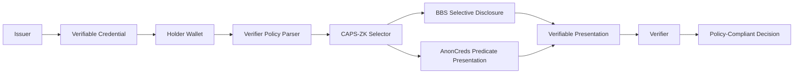
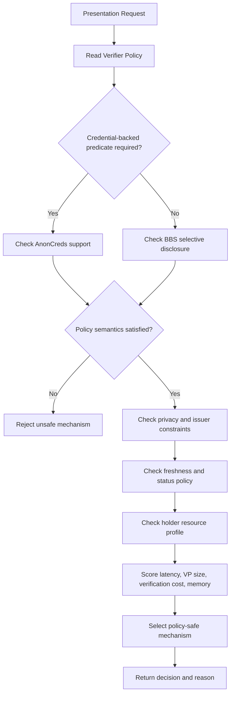

> LightDID-ZKP is a policy- and resource-aware framework for selecting the correct privacy-preserving verifiable presentation backend in decentralized identity systems. It focuses on choosing between BBS selective-disclosure presentations and AnonCreds predicate presentations without allowing unsafe privacy downgrades or cost-only fallback decisions.

::github{repo="dranubhaparashar/LightDID-ZKP"}

---


> Wiki documentation: [Home](https://github.com/dranubhaparashar/LightDID-ZKP/wiki) · [Architecture](https://github.com/dranubhaparashar/LightDID-ZKP/wiki/Architecture-and-Design) · [CAPS-ZK Selection Logic](https://github.com/dranubhaparashar/LightDID-ZKP/wiki/CAPS-ZK-Selection-Logic) · [Policy Model](https://github.com/dranubhaparashar/LightDID-ZKP/wiki/Policy-Model) · [Experiment Protocol](https://github.com/dranubhaparashar/LightDID-ZKP/wiki/Experiment-Protocol) · [Results and Figures](https://github.com/dranubhaparashar/LightDID-ZKP/wiki/Results-and-Figures)
>
> Reproducibility: [Reproducing the Paper Tables](https://github.com/dranubhaparashar/LightDID-ZKP/wiki/Reproducing-the-Paper-Tables) · [Optional Real-Backend Benchmarks](https://github.com/dranubhaparashar/LightDID-ZKP/wiki/Optional-Real-Backend-Benchmarks)
>
> Claim boundary: [Security, Privacy, and Claim Boundary](https://github.com/dranubhaparashar/LightDID-ZKP/wiki/Security,-Privacy-and-Claim-Boundary)

---

## One-Line Idea

LightDID-ZKP selects the right privacy-preserving presentation mechanism by checking verifier policy semantics, privacy requirements, credential-backed predicate needs, and device resource limits before applying cost scoring.

The core idea is simple:

**Do not choose the cheapest proof first. Choose only from mechanisms that satisfy the verifier policy and privacy semantics, then optimize for cost.**

---

## Why This Project Exists

Decentralized identity systems increasingly support privacy-preserving verifiable presentations. A holder wallet may support more than one presentation mechanism, but each mechanism is suitable for a different kind of verifier request.

For example, a verifier may ask for selected attributes such as name, degree, institution, or membership status. In such cases, a BBS-style selective-disclosure presentation can reveal only the required fields while hiding the rest.

Another verifier may ask for a predicate such as age greater than 18, income above a threshold, eligibility status, or another credential-backed condition. In that case, simple selective disclosure is not enough because the verifier needs proof that a hidden predicate is satisfied.

LightDID-ZKP addresses this decision problem. It introduces a selector that does not treat all proof systems as interchangeable. Instead, it checks the policy, privacy level, predicate requirement, issuer binding, freshness rule, status-policy requirement, and device constraints before selecting the presentation backend.

---

## Project at a Glance

| Area | Description |
|---|---|
| Full Form | Lightweight Decentralized Identity Zero-Knowledge Presentation Selector |
| Project Type | Self research project and reproducible prototype |
| Primary Goal | Select between BBS and AnonCreds verifiable presentation backends using policy and resource constraints |
| Core Selector | CAPS-ZK: Capability- and Policy-Safe Zero-Knowledge selector |
| Main Mechanisms | BBS selective disclosure and AnonCreds predicate presentation |
| Main Users | DID wallet developers, identity researchers, privacy engineers, academic reviewers, ZKP learners |
| Input | Verifier policy, holder capabilities, credential metadata, privacy requirement, resource profile |
| Output | Selected presentation mechanism, rejection reason, cost score, policy-safety explanation |
| Main Repository | `dranubhaparashar/LightDID-ZKP` |
| Documentation Surface | GitHub README and Wiki pages |
| Claim Boundary | Research prototype, not a production DID wallet or new cryptographic primitive |

---

## What Makes LightDID-ZKP Different

> **Important**
>
> LightDID-ZKP is not a new cryptographic proof primitive. It is a selector and orchestration layer above existing presentation mechanisms.

| Ordinary Cost-First Choice | LightDID-ZKP Approach |
|---|---|
| Chooses the lowest latency backend | First checks whether the backend satisfies verifier policy semantics |
| Treats disclosure and predicate proof as interchangeable | Distinguishes selective disclosure from credential-backed predicates |
| Falls back to a cheaper proof even when semantics differ | Rejects unsafe fallback |
| Optimizes only for size or speed | Balances policy fit, privacy level, latency, VP size, verification cost, and memory |
| Gives weak explanation for backend choice | Produces a reasoned selector decision |
| Ignores claim boundary | Clearly states what the prototype does and does not prove |

---

## Reader Walkthrough

A reader can understand LightDID-ZKP in five steps:

1. **Verifier sends a presentation request** containing required attributes, predicate needs, issuer requirements, freshness expectations, status-policy rules, and resource constraints.
2. **CAPS-ZK parses the policy** and identifies whether the request requires selective disclosure, credential-backed predicates, or both.
3. **Candidate mechanisms are filtered** using semantic, privacy, predicate, issuer-binding, freshness, status-policy, and resource checks.
4. **Only safe mechanisms are scored** using latency, proof size, verification cost, and memory indicators.
5. **The selected backend is returned** with a reason. If no backend satisfies the policy safely, the selector rejects the request instead of downgrading privacy or semantics.

---

## System Architecture



LightDID-ZKP separates credential issuance, holder-side decision logic, backend selection, cryptographic presentation generation, and verifier-side policy checking.

CAPS-ZK does not replace BBS or AnonCreds. It decides when each mechanism is appropriate and prevents unsafe substitutions.

---

## CAPS-ZK Selection Workflow



The workflow is intentionally policy-first. Resource optimization is applied only after the mechanism passes the safety and semantics checks.

---

## Core Modules

### 1. Policy Model

The policy model represents what the verifier is actually asking for. It includes attribute disclosure requirements, predicate requirements, issuer binding, freshness rules, credential status rules, privacy level, and domain binding.

The goal is to make the selector understand the difference between:

- revealing a selected attribute, and
- proving a hidden predicate about an attribute.

This distinction is important because selective disclosure should not be used as an unsafe substitute for a required hidden predicate.

### 2. Capability Model

The capability layer describes what each backend can support. BBS is modeled for selective disclosure. AnonCreds is modeled for credential-backed predicates. CAPS-ZK checks these capabilities before using a backend.

### 3. Privacy-Level Abstraction

The selector assigns a privacy meaning to each mechanism. A presentation that reveals an attribute is not privacy-equivalent to a predicate proof that keeps the attribute hidden.

This allows LightDID-ZKP to prevent privacy downgrades.

### 4. Resource Profiler

The resource profile captures holder-side constraints such as latency budget, available memory, verification cost tolerance, and maximum acceptable verifiable presentation size.

This is useful for wallets running on constrained devices or mobile-like environments.

### 5. Cost Scorer

After unsafe mechanisms are removed, the remaining candidates are scored using measured or configured cost indicators. The cost scorer helps pick the most practical valid backend.

### 6. Backend Adapter Layer

The backend adapter layer keeps the selector independent from specific cryptographic implementation details. The repository includes optional real-backend templates so the framework can be extended with concrete BBS or AnonCreds libraries.

---

## Presentation Profiles

| Profile | Main Purpose | Typical Selection Case |
|---|---|---|
| BBS selective disclosure | Reveal selected attributes from a signed credential | Attribute disclosure without hidden predicate proof |
| AnonCreds predicate presentation | Prove credential-backed predicates | Age, threshold, eligibility, or range-style requirements |
| CAPS-ZK selector | Select the correct presentation backend | Policy-aware and resource-aware wallet decision |
| Policy-safe rejection | Refuse unsafe fallback | No backend satisfies required semantics safely |

---

## End-to-End Workflow

| Stage | What Happens | Output |
|---|---|---|
| 1. Presentation Request | Verifier requests disclosure or predicate proof | Policy object |
| 2. Policy Parsing | Selector extracts semantic and privacy requirements | Normalized verifier policy |
| 3. Capability Filtering | Backends that cannot satisfy the request are removed | Valid candidate set |
| 4. Privacy Filtering | Mechanisms that downgrade privacy are rejected | Privacy-safe candidate set |
| 5. Issuer and Freshness Checks | Issuer, status, and freshness rules are validated | Policy-compliant candidate set |
| 6. Resource Filtering | Device limits are checked | Runtime-feasible candidates |
| 7. Cost Scoring | Latency, VP size, verification time, and memory are compared | Ranked backend list |
| 8. Selection or Rejection | Best safe backend is selected, or request is rejected | Decision and reason |
| 9. Presentation Generation | Chosen backend generates the VP | Verifiable presentation |
| 10. Verifier Decision | Verifier checks the VP and policy compliance | Accept/reject result |

---

## Example Decision Cases

### Case A: Selective Attribute Disclosure

A verifier asks the holder to reveal only:

- name,
- degree,
- institution.

No hidden predicate is required.

**Expected selector behavior:** choose BBS selective disclosure if it satisfies the issuer, freshness, status, and resource constraints.

### Case B: Age Predicate

A verifier asks the holder to prove:

- age is greater than or equal to 18,
- without revealing the exact date of birth.

**Expected selector behavior:** choose AnonCreds predicate presentation if credential-backed predicate proof is required.

### Case C: Unsafe Cost-First Fallback

A cheaper backend exists, but it cannot prove the required predicate.

**Expected selector behavior:** reject unsafe fallback. LightDID-ZKP should not replace a hidden predicate proof with simple disclosure just because it is cheaper.

---

## Experiment Protocol

The experiment package follows a manuscript-style reproducibility setup.

| Item | Configuration |
|---|---|
| Warmup runs | 5 |
| Measured runs | 50 |
| Attribute counts | 4, 8, 16, 32, 64 |
| Mechanisms | BBS and AnonCreds |
| Main metrics | Proving latency, verification latency, VP size, RSS memory, coefficient of variation |
| Supporting studies | Selector decisions, ablation, resource sensitivity |
| Outputs | Tables, figures, CSV summaries, decision logs |

The repository contains benchmark summaries, selector decisions, ablation results, resource-sensitivity outputs, and generated figures.

---

## Repository Structure

```text
LightDID-ZKP
├── assets/
│   └── diagrams/
│       ├── lightdid_banner.svg
│       ├── lightdid_layered_architecture.svg
│       ├── caps_zk_selection_flow.svg
│       ├── experiment_pipeline.svg
│       └── verifier_metadata_guard.svg
│
├── benchmarks/
│   ├── lightdid_benchmark_summary.csv
│   ├── selector_decisions.csv
│   ├── resource_sensitivity.csv
│   └── ablation_cost_first_fallback.csv
│
├── configs/
│   ├── policies.yaml
│   ├── device_profiles.yaml
│   └── experiment_config.yaml
│
├── docs/
│   ├── ARCHITECTURE.md
│   ├── DEVELOPER_GUIDE.md
│   ├── REVIEWER_NOTES.md
│   └── GITHUB_ABOUT.md
│
├── experiments/
│   ├── run_all.py
│   ├── generate_tables.py
│   ├── plot_results.py
│   └── optional_real_backend_templates/
│
├── results/
│   ├── figures/
│   └── tables/
│
├── src/
│   └── lightdid_zkp/
│       ├── selector.py
│       ├── policy.py
│       ├── profiles.py
│       ├── metrics.py
│       └── utils.py
│
├── tests/
│   └── test_selector.py
│
├── README.md
├── requirements.txt
├── pyproject.toml
├── CITATION.cff
└── LICENSE
```

---

## Important Project Paths

| Component | Path |
|---|---|
| Main selector code | `src/lightdid_zkp/selector.py` |
| Policy model | `src/lightdid_zkp/policy.py` |
| Device profiles | `src/lightdid_zkp/profiles.py` |
| Experiment runner | `experiments/run_all.py` |
| Table generation | `experiments/generate_tables.py` |
| Plot generation | `experiments/plot_results.py` |
| Policy configs | `configs/policies.yaml` |
| Device configs | `configs/device_profiles.yaml` |
| Benchmark CSV files | `benchmarks/` |
| Result tables | `results/tables/` |
| Result figures | `results/figures/` |
| Architecture diagrams | `assets/diagrams/` |
| Developer notes | `docs/` |
| Tests | `tests/` |

---

## Local Run Command

Create and activate a Python environment:

```bash
python -m venv .venv
```

Windows:

```bash
.venv\Scripts\activate
```

macOS/Linux:

```bash
source .venv/bin/activate
```

Install dependencies:

```bash
pip install -r requirements.txt
```

Run the full experiment pipeline:

```bash
python experiments/run_all.py
```

Run tests:

```bash
pytest -q
```

---

## Reproduce Tables and Figures

Generate manuscript-style tables:

```bash
python experiments/generate_tables.py
```

Generate result figures:

```bash
python experiments/plot_results.py
```

Outputs are saved in:

```text
results/tables/
results/figures/
```

---

## Example Selector Usage

```python
from lightdid_zkp.selector import select_presentation
from lightdid_zkp.policy import VerifierPolicy
from lightdid_zkp.profiles import DeviceProfile

policy = VerifierPolicy(
    required_attributes=["name", "degree", "institution"],
    predicate_requirements=[],
    max_vp_size_kb=32,
    require_credential_backed_predicate=False,
)

device = DeviceProfile(
    name="mobile_like",
    max_latency_ms=500,
    max_memory_mb=512,
)

decision = select_presentation(policy=policy, device=device)

print("Selected mechanism:", decision.mechanism)
print("Reason:", decision.reason)
```

Example output for selective disclosure:

```text
Selected mechanism: BBS
Reason: Policy requires selective disclosure only; BBS satisfies disclosure constraints with lower estimated presentation size.
```

Example output for predicate-heavy policies:

```text
Selected mechanism: AnonCreds
Reason: Verifier policy requires credential-backed predicate proof; AnonCreds satisfies predicate semantics.
```

---

## Project Links

::github{repo="dranubhaparashar/LightDID-ZKP"}

- **Wiki Home:** [LightDID-ZKP Wiki](https://github.com/dranubhaparashar/LightDID-ZKP/wiki)
- **Architecture:** [Architecture and Design](https://github.com/dranubhaparashar/LightDID-ZKP/wiki/Architecture-and-Design)
- **CAPS-ZK Logic:** [CAPS-ZK Selection Logic](https://github.com/dranubhaparashar/LightDID-ZKP/wiki/CAPS-ZK-Selection-Logic)
- **Policy Model:** [Policy Model](https://github.com/dranubhaparashar/LightDID-ZKP/wiki/Policy-Model)
- **Experiments:** [Experiment Protocol](https://github.com/dranubhaparashar/LightDID-ZKP/wiki/Experiment-Protocol)
- **Results:** [Results and Figures](https://github.com/dranubhaparashar/LightDID-ZKP/wiki/Results-and-Figures)
- **Claim Boundary:** [Security, Privacy, and Claim Boundary](https://github.com/dranubhaparashar/LightDID-ZKP/wiki/Security,-Privacy-and-Claim-Boundary)

---

## Documentation and Wiki Links

Because this project does not currently have a YouTube walkthrough, the Wiki is the main public explanation surface.

| Wiki Page | Purpose |
|---|---|
| [Home](https://github.com/dranubhaparashar/LightDID-ZKP/wiki) | Main entry point for the project |
| [About LightDID-ZKP](https://github.com/dranubhaparashar/LightDID-ZKP/wiki/About-LightDID-ZKP) | Short overview and motivation |
| [Architecture and Design](https://github.com/dranubhaparashar/LightDID-ZKP/wiki/Architecture-and-Design) | System design and component view |
| [CAPS-ZK Selection Logic](https://github.com/dranubhaparashar/LightDID-ZKP/wiki/CAPS-ZK-Selection-Logic) | Selector logic and filtering sequence |
| [Policy Model](https://github.com/dranubhaparashar/LightDID-ZKP/wiki/Policy-Model) | Formal policy inputs and constraints |
| [Experiment Protocol](https://github.com/dranubhaparashar/LightDID-ZKP/wiki/Experiment-Protocol) | Benchmarking and evaluation setup |
| [Results and Figures](https://github.com/dranubhaparashar/LightDID-ZKP/wiki/Results-and-Figures) | Output tables and generated figures |
| [Reproducing the Paper Tables](https://github.com/dranubhaparashar/LightDID-ZKP/wiki/Reproducing-the-Paper-Tables) | Steps for reproducibility |
| [Optional Real-Backend Benchmarks](https://github.com/dranubhaparashar/LightDID-ZKP/wiki/Optional-Real-Backend-Benchmarks) | Notes for real BBS/AnonCreds backend experiments |
| [Repository Structure](https://github.com/dranubhaparashar/LightDID-ZKP/wiki/Repository-Structure) | File and folder explanation |
| [Security, Privacy, and Claim Boundary](https://github.com/dranubhaparashar/LightDID-ZKP/wiki/Security,-Privacy-and-Claim-Boundary) | What the project does and does not claim |
| [Developer Guide](https://github.com/dranubhaparashar/LightDID-ZKP/wiki/Developer-Guide) | Developer notes and extension points |
| [Quick Links](https://github.com/dranubhaparashar/LightDID-ZKP/wiki/Quick-Links) | Fast navigation page |

---

## Architecture Diagrams

The repository includes project diagrams under `assets/diagrams/`.

| Diagram | Link |
|---|---|
| LightDID-ZKP Banner | `assets/diagrams/lightdid_banner.svg` |
| Layered Architecture | `assets/diagrams/lightdid_layered_architecture.svg` |
| CAPS-ZK Selection Flow | `assets/diagrams/caps_zk_selection_flow.svg` |
| Experiment Pipeline | `assets/diagrams/experiment_pipeline.svg` |
| Verifier Metadata Guard | `assets/diagrams/verifier_metadata_guard.svg` |

---

## Result Files

The repository includes result files for:

- BBS presentation latency,
- AnonCreds presentation latency,
- verification time,
- verifiable presentation size,
- RSS memory usage,
- coefficient of variation,
- selector decisions across policy types,
- ablation comparison against unsafe cost-first fallback,
- resource-sensitivity analysis.

Result folders:

```text
benchmarks/
results/tables/
results/figures/
```

---

## Research Scope and Claim Boundary

LightDID-ZKP is intended as a research prototype for privacy-preserving decentralized identity presentation selection.

It does **not** claim to:

- introduce a new zero-knowledge proof primitive,
- replace BBS or AnonCreds,
- provide production wallet security certification,
- prove constrained-device deployment without real device measurements,
- implement a complete DID wallet,
- provide legal or compliance certification for digital identity deployments.

It does claim to:

- provide a policy-aware selection framework,
- provide a resource-aware presentation decision layer,
- compare presentation-level trade-offs,
- support reproducibility through scripts, tables, and figures,
- demonstrate why policy semantics must be checked before cost optimization.

---

## Practical Use Cases

| User Group | How LightDID-ZKP Helps |
|---|---|
| DID wallet developers | Provides a policy-safe way to choose between multiple presentation backends |
| Identity researchers | Demonstrates a formal selector model for privacy-preserving verifiable presentations |
| ZKP learners | Shows why selective disclosure and predicate proofs are not interchangeable |
| Academic reviewers | Provides reproducible scripts, tables, diagrams, and clear claim boundaries |
| Privacy engineers | Highlights unsafe fallback and privacy-downgrade risks |
| Standards readers | Connects verifier policy semantics with presentation backend selection |
| Project evaluators | Provides GitHub repository, Wiki documentation, diagrams, and experiment outputs |

---

## Engineering Value

LightDID-ZKP demonstrates how decentralized identity presentation selection can be treated as an engineering decision problem rather than only a cryptographic primitive choice.

The project connects:

- verifier policy parsing,
- backend capability modeling,
- privacy-level abstraction,
- predicate requirement checking,
- resource filtering,
- benchmark-driven cost scoring,
- safe rejection,
- reproducible experiment generation,
- GitHub documentation and Wiki publishing.

This makes the project useful as a research prototype, academic support repository, and technical portfolio project.

---

## Current Strengths

- Clear focus on decentralized identity and verifiable presentation selection.
- Separates policy correctness from cost optimization.
- Distinguishes BBS selective disclosure from AnonCreds predicate presentation.
- Prevents unsafe fallback and privacy downgrades.
- Includes reproducibility scripts, tables, result files, and diagrams.
- Provides GitHub Wiki documentation instead of relying only on README text.
- States a clear claim boundary, which is important for research credibility.
- Suitable for manuscript support, GitHub portfolio display, and technical review.

---

## Key Innovation

> **Key point**
>
> The strongest innovation is not claiming a new proof system. The strongest innovation is the policy-safe selector: LightDID-ZKP checks whether a presentation backend satisfies verifier semantics and privacy requirements before optimizing for resource cost.

Most systems discuss proof mechanisms individually. LightDID-ZKP focuses on the wallet-side decision problem that appears when multiple privacy-preserving presentation mechanisms are available.

---

## Conclusion

LightDID-ZKP shows how decentralized identity wallets can make safer presentation choices when multiple privacy-preserving mechanisms are available.

It connects verifier policy, privacy semantics, backend capability, resource feasibility, and cost scoring into one reproducible framework.

The project is valuable because it explains a practical identity-system problem: a low-cost proof is not acceptable if it does not satisfy the verifier’s actual requirement. By placing policy safety before cost optimization, LightDID-ZKP provides a clean and credible research direction for privacy-preserving decentralized identity presentation selection.

---

## Final Thought

> Policy first. Privacy second. Cost only after safety.
>
> LightDID-ZKP is about making decentralized identity presentation selection safer, explainable, and reproducible.
>
> BBS selective disclosure · AnonCreds predicates · CAPS-ZK selector · no unsafe fallback · no privacy downgrade · GitHub Wiki documentation
