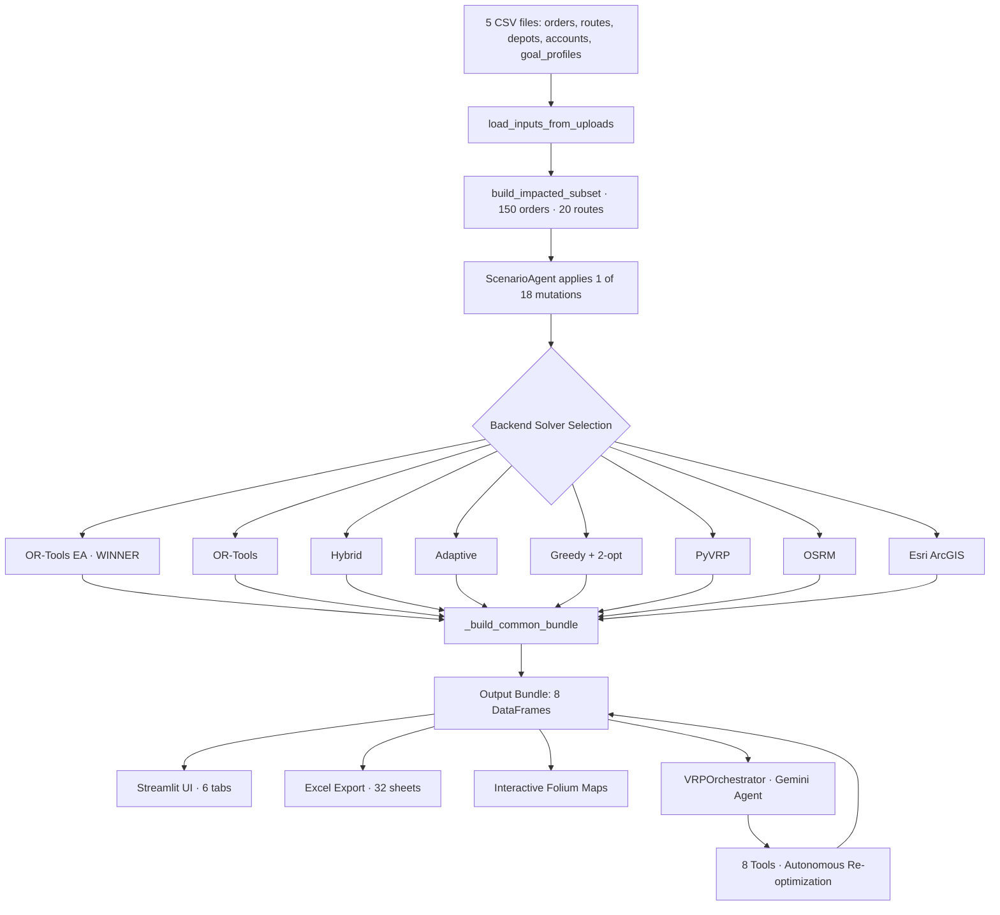
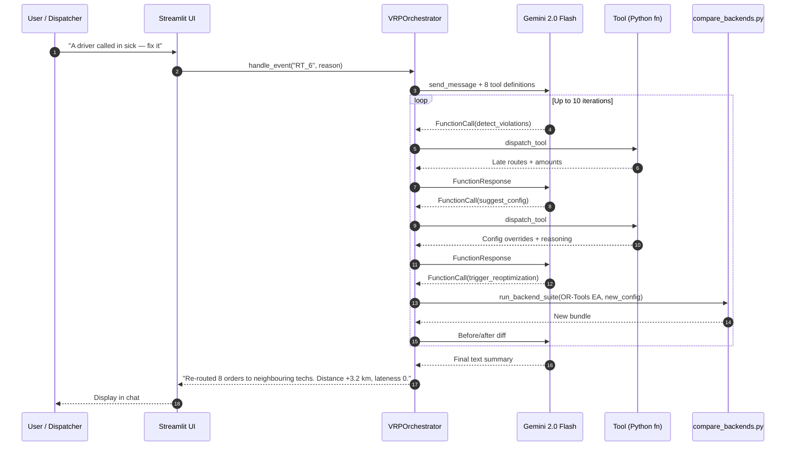
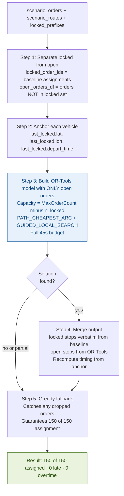
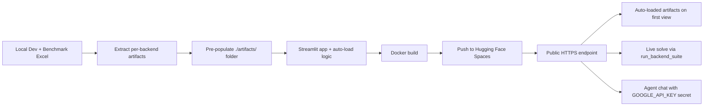
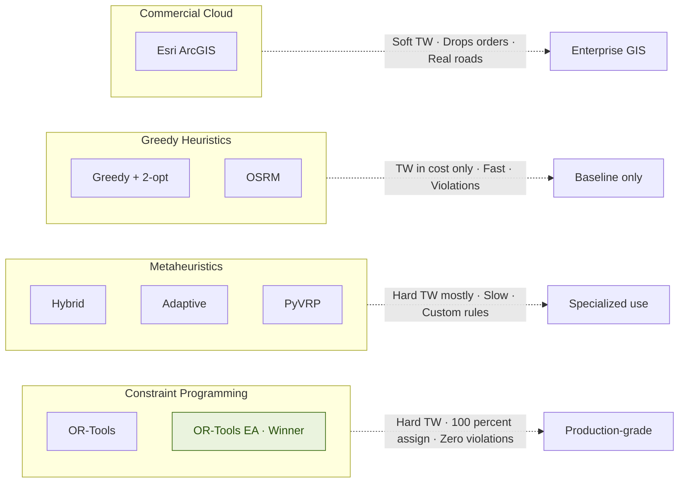

> Building an AI system that doesn't just **solve routes** — but combines 8 solver backends, 18 real-world scenarios, an Agentic AI orchestrator, and a benchmark-grade Streamlit studio into a single execution-aware optimization platform.

::github{repo="dranubhaparashar/Execution-Aware-Agentic-VRP-Solver-and-Benchmark-Studio"}

---

> 🎥 **Live demo video:** [youtu.be/FqVuVjW20yo](https://youtu.be/FqVuVjW20yo)
>
> 🚀 **Try it live:** [Hugging Face Space](https://huggingface.co/spaces/AnubhaParashar/Execution-Aware-Agentic-VRP-Solver-and-Benchmark-Studio)

---

## Vision

Most VRP solvers stop at producing a route plan.

This project focuses on the full operational chain required to make routing decisions usable in a **live dispatch environment** where technicians are already in motion, jobs get cancelled mid-day, urgent orders inject themselves into the schedule, and shifts change without notice:

- Ingest 40,000 orders, 400 routes, 8 depots, multi-customer goal profiles
- Run 8 different solver backends in parallel (greedy, metaheuristic, constraint programming, cloud APIs)
- Stress-test against 18 operational scenarios (cancellations, sick technicians, urgent injects, SLA shifts)
- Lock in-progress routes so re-optimization preserves real-world execution state
- Expose an Agentic AI layer that detects violations and triggers re-optimization autonomously
- Provide a benchmark studio with KPI charts, interactive maps, and Excel export
- Deploy to Hugging Face Spaces with pre-computed artifacts for instant demo

---

## Project Attributes

| Attribute | Description |
|---|---|
| `problem-statement` | Standard VRP solvers re-plan from scratch on every disruption — they're not aware that some stops are *already in execution*, leading to wasteful re-routing of stable assignments. |
| `primary-objective` | Build an execution-aware VRP platform that compares 8 solver families, locks in-progress work, and lets an AI agent autonomously fix constraint violations. |
| `core-technologies` | Python 3.11, Streamlit, Google OR-Tools, PyVRP, OSRM, Esri ArcGIS, Google Gemini 2.0 Flash, Folium, Plotly, Docker, Hugging Face Spaces. |
| `repository-scope` | 8,140 lines across 4 source files · 18 fixed test scenarios · benchmark dataset · pre-computed artifacts · architecture docs · full function reference. |
| `runtime-interface` | Streamlit 6-tab UI: Overview · KPI Comparison · Map Explorer · Scenario Tables · Excel Export · 🤖 AI Agent. |
| `deployment-target` | Hugging Face Spaces (Docker SDK) for public demo · Self-hosted Streamlit for production. |
| `demo-surface` | Public HF Space with auto-loaded synthetic dataset and pre-computed benchmark artifacts. |
| `key-capabilities` | 8 solver backends, locked-prefix re-optimization, agentic AI with 8 tools, interactive route maps, multi-sheet Excel export, reactive event handling. |
| `security-controls` | Environment-driven API keys (GOOGLE_API_KEY) · Optional Esri portal authentication · No hardcoded credentials. |
| `production-focus` | Reproducible benchmarks · 100% assignment guarantees · zero-violation winner backend · sub-1000s runtime · cloud-deployable Docker image. |

---

## Project Structure

```plaintext title="Repository + Blog Layout"
src/content/posts/
└── execution-aware-agentic-vrp/
    ├── cover.png
    └── index.mdx

GitHub Repo: dranubhaparashar/Execution-Aware-Agentic-VRP-Solver-and-Benchmark-Studio/
├── app.py                           # Streamlit UI · 6 tabs · 845 lines
├── base_engine.py                   # 5 agents + scenario engine · 933 lines
├── compare_backends.py              # 8 solver backends + helpers · 5,438 lines
├── vrp_agent.py                     # Gemini agent + 8 tools · 960 lines
├── Dockerfile                       # HF Spaces deployment
├── requirements.txt
├── data/                            # Auto-loaded on startup
│   ├── orders_40000.csv
│   ├── routes_400.csv
│   ├── depots_8.csv
│   ├── accounts.csv
│   └── goal_profiles.csv
├── artifacts/                       # Pre-computed benchmark results (8 backends)
│   ├── OR-Tools_Execution-Aware/
│   │   └── vrp_scenario_results_full.xlsx
│   ├── OR-Tools/
│   ├── Hybrid_Execution-Aware_Rolling_VRP_Solver/
│   ├── Adaptive_Execution-Aware_Metaheuristic_Solver/
│   ├── Impacted-Subset_Greedy_2-opt/
│   ├── PyVRP/
│   ├── OSRM/
│   └── Esri/
└── docs/
    ├── ARCHITECTURE.md
    ├── ALGORITHM_COMPARISON.md
    └── REFERENCE_*.md (4 function reference files)
```

---

## Why This Matters

:::note
A vehicle routing solver becomes operationally useful only when it is **execution-aware, comparable, and self-correcting**.
:::

:::important
Real dispatch environments are not static — orders cancel, technicians call in sick, urgents inject mid-day. This project covers the missing layer between **batch route planning** and **live re-optimization with locked execution state**.
:::

:::tip
The 8-backend benchmark format generalizes to any combinatorial routing problem — replace the scenarios and orders, the comparative scaffold remains useful.
:::

:::warning
Lowest-distance solutions are not always best — PyVRP achieves the shortest routes (114 km) but produces 134,483 minutes of lateness. Constraint adherence matters as much as distance.
:::

:::caution
Public demo deployments should never use production API keys, real customer data, or unrestricted solver access. Use the included synthetic dataset for showcases.
:::

---

## What This System Does



---

## Agentic AI Request Flow



---

## Core Capabilities

- 8 solver backends spanning greedy, metaheuristic, constraint programming, and cloud APIs
- 18 fixed operational scenarios for reproducible benchmarking
- Locked-prefix re-optimization that preserves in-progress technician work
- Agentic AI layer with 8 callable tools and 4 distinct agentic behaviors
- Interactive Folium route maps per scenario per backend
- 6-tab Streamlit UI with KPI charts, scenario tables, and Excel export
- Pre-computed artifacts that auto-load on app startup
- Hugging Face Spaces deployment via Docker
- BackendConfig with 28 tunable parameters exposed in the sidebar
- Reactive event buttons for sick driver, urgent order, cancellation, and shift change

---

## Bento Overview

| Layer | Description |
|---|---|
| Data Layer | 40,000 orders · 400 routes · 8 depots · 4 goal profiles · auto-loaded from `./data/` |
| Scenario Layer | 18 mutations across BASE, EAS_1-4, RT_1-7, GB_1-6 areas |
| Solver Layer | 8 backends with consistent input/output contract via `_build_common_bundle` |
| Re-optimization Layer | Locked-prefix mechanism preserves stable assignments, only re-solves open work |
| Agent Layer | Gemini 2.0 Flash with function-calling, autonomous tool chaining, max 10 iterations |
| UI Layer | Streamlit 6 tabs: Overview, KPI, Map, Scenario, Export, AI Agent |
| Artifact Layer | Per-backend Excel + Folium HTML + PNG previews saved to `./artifacts/` |
| Deployment Layer | Docker image deployable to HF Spaces or any container host |

---

## The 8 Solver Backends — Benchmark Results

Tested on 150 orders · 20 routes · 18 scenarios from the included synthetic dataset.

| Rank | Backend | Algorithm | Assigned | BASE km | Late min | OT min | Runtime s |
|---|---|---|---|---|---|---|---|
| 🥇 | **OR-Tools EA** | Split-solve CP + GLS | **150** | **231.8** | **0** | **0** | **770** |
| 2 | OR-Tools | CVRPTW + Guided Local Search | 150 | 233.2 | 0 | 0 | 868 |
| 3 | Esri | Tabu Search (cloud) | 142 | 238.7 | 34 | 0 | 973 |
| 4 | Adaptive | Multi-restart regret | 150 | 424.1 | 0 | 0 | 6,472 |
| 5 | Hybrid | Regret + LNS | 150 | 424.1 | 0 | 0 | 1,790 |
| 6 | Greedy | Nearest-neighbor + 2-opt | 150 | 394.4 | 12,729 | 2,761 | 22 |
| 7 | PyVRP | Hybrid Genetic Search | 150 | 114.0 | 7,479 | 3,695 | 545 |
| 8 | OSRM | Greedy + road distances | 150 | 519.3 | 13,176 | 2,859 | 4,949 |

:::important
**OR-Tools EA is the only backend that achieves all four production requirements:** 100% assignment, zero violations, sub-1000s runtime, and locked-prefix support.
:::

---

## The Innovation: Split-Solve Architecture

The OR-Tools Execution-Aware backend introduces a key architectural innovation. Locked orders **never enter the OR-Tools model** — they're copied verbatim from the baseline. Only open orders are submitted to the solver.



### Why naive pinning fails

Submitting all 150 orders to OR-Tools with 130 of them having zero-slack time windows makes `PATH_CHEAPEST_ARC` infeasible. The solver fails to find any first solution within the time budget and returns 0 assignments.

By only submitting ~10 open orders, the model is **10-15x smaller**, the first solution comes instantly, and GLS gets the full 45s budget for improvement. Result: **11% faster than plain OR-Tools** and **0.6-3.4 km better** across all scenario groups.

---

## Detection and Solver Stack

### Solver Family Coverage

- **Constraint Programming:** OR-Tools, OR-Tools EA
- **Metaheuristics:** Hybrid, Adaptive, PyVRP
- **Greedy Heuristics:** Greedy + 2-opt, OSRM
- **Commercial Cloud:** Esri ArcGIS Network Analyst

### Scenario Coverage

- **Execution-Aware (EAS_1-4):** Job timing changes mid-execution
- **Real-Time (RT_1-7):** Cancellations, sick drivers, urgent injects, shift delays
- **Goal-Based (GB_1-6):** Customer-specific weight overrides for travel/SLA/skill/overtime

### Output Bundle (per backend)

- `scenario_summary` — 18 rows × 11 columns
- `route_output_all` — ~360 rows
- `stop_output_all` — ~2,700 rows
- `order_output_all`
- `scenario_actions`
- `scenario_timings`
- `requirement_checklist`
- `run_meta`

---

## Agentic AI Layer

```python title="vrp_agent.py" {"Init Gemini":1-15} {"Agent loop":17-42} {"Tool dispatch":44-52}
import google.generativeai as genai
from google.generativeai import protos
import os, json

class VRPOrchestrator:
    def __init__(self, inputs, config, existing_results=None, progress_cb=None):
        self.inputs = inputs
        self.config = config
        self.results = existing_results or {}
        self._tool_calls_log = []
        self._chat_session = None

        genai.configure(api_key=os.environ["GOOGLE_API_KEY"])
        self._genai = genai
        self._model = genai.GenerativeModel(
            model_name="gemini-2.0-flash",
            tools=self._build_gemini_tools(),
            system_instruction=self._build_system_prompt(),
        )

    def chat(self, user_message: str) -> str:
        if self._chat_session is None:
            self._chat_session = self._model.start_chat(
                enable_automatic_function_calling=False
            )
        return self._run_agent_loop(user_message)

    def _run_agent_loop(self, user_message: str) -> str:
        max_iterations = 10
        iteration = 0
        current_message = user_message

        while iteration < max_iterations:
            iteration += 1
            response = self._chat_session.send_message(current_message)

            fn_calls = []
            for candidate in response.candidates:
                for part in candidate.content.parts:
                    if hasattr(part, "function_call") and part.function_call.name:
                        fn_calls.append(part.function_call)

            if not fn_calls:
                # Pure text response — agent is done
                return " ".join(p.text for c in response.candidates
                                for p in c.content.parts if hasattr(p, "text"))

            # Execute all function calls
            fn_responses = []
            for fn_call in fn_calls:
                result = self._dispatch_tool(fn_call.name, dict(fn_call.args))
                self._tool_calls_log.append({
                    "tool": fn_call.name,
                    "input": dict(fn_call.args),
                    "result_preview": str(result)[:200],
                })
                fn_responses.append(
                    self._genai.protos.Part(
                        function_response=self._genai.protos.FunctionResponse(
                            name=fn_call.name,
                            response={"result": json.dumps(result, default=str)},
                        )
                    )
                )

            current_message = self._genai.protos.Content(
                role="user", parts=fn_responses,
            )

        return "Agent reached max iterations."
```

### The 8 Agent Tools

| Tool | Purpose |
|---|---|
| `get_scenario_list` | Returns all 18 scenario IDs and descriptions |
| `explain_scenario` | Explains what a scenario tests + what mutation it applies |
| `analyze_results` | Reads loaded bundles, surfaces metrics + violations |
| `detect_violations` | Finds late routes/orders + overtime amounts |
| `compare_backends` | Ranks backends by chosen priority criterion |
| `suggest_config` | Recommends BackendConfig overrides with reasoning |
| `run_backend` | Triggers a live solve and returns summary metrics |
| `trigger_reoptimization` | Re-runs with improved config, returns before/after diff |

### 4 Agentic Behaviors

1. **Natural language interpretation** — `"Which backend is best for SLA?"`
2. **Autonomous re-optimization** — agent detects violations, picks config, re-runs, compares
3. **Multi-step reasoning** — `"Run A and B, then tell me which wins"` chains 3+ tool calls
4. **Real-time reactive** — one-click event buttons trigger autonomous handling

---

## Dependency Stack

```txt title="requirements.txt"
streamlit>=1.28,<2.0
pandas>=2.0
numpy>=1.24
ortools>=9.7
folium>=0.15
streamlit-folium>=0.15
plotly>=5.18
openpyxl>=3.1
requests>=2.31
google-generativeai>=0.5
nbformat>=5.9
matplotlib>=3.7
python-dateutil>=2.8
```

---

## Containerization Layer

```dockerfile title="Dockerfile" {"Base":1} {"User":7-11} {"Install deps":13-15} {"Streamlit start":21-27}
FROM python:3.11-slim

RUN apt-get update && apt-get install -y --no-install-recommends \
    build-essential \
    && rm -rf /var/lib/apt/lists/*

RUN useradd -m -u 1000 user
USER user
ENV PATH="/home/user/.local/bin:$PATH"
WORKDIR /home/user/app

COPY --chown=user requirements.txt requirements.txt
RUN pip install --no-cache-dir --upgrade pip && \
    pip install --no-cache-dir -r requirements.txt

COPY --chown=user . .

EXPOSE 7860

CMD ["streamlit", "run", "app.py", \
     "--server.port=7860", \
     "--server.address=0.0.0.0", \
     "--server.headless=true", \
     "--server.enableCORS=false", \
     "--server.enableXsrfProtection=false", \
     "--browser.gatherUsageStats=false"]
```

---

## Deployment Path



---

## Runtime Example

```bash title="run-locally.sh"
# Clone the repo
git clone https://github.com/dranubhaparashar/Execution-Aware-Agentic-VRP-Solver-and-Benchmark-Studio.git
cd Execution-Aware-Agentic-VRP-Solver-and-Benchmark-Studio

# Create virtual environment
python -m venv vrp
source vrp/bin/activate

# Install dependencies
pip install -r requirements.txt

# Set free Gemini API key from aistudio.google.com (no credit card)
export GOOGLE_API_KEY="YOUR_GOOGLE_API_KEY"

# Run the app
streamlit run app.py --server.port 8504

# Open http://localhost:8504
# Auto-loads synthetic data + pre-computed artifacts
# Click "Build comparison" to see all 8 backends instantly
# Open the AI Agent tab to chat with Gemini
```

---

## Hugging Face Deployment Pattern

- Build a Docker image with the Streamlit app and pre-computed artifacts
- Upload to Hugging Face Spaces (Docker SDK)
- Set `GOOGLE_API_KEY` as a Space secret
- Public HTTPS endpoint serves the auto-loaded studio
- Anyone can view benchmark results without running solvers
- Live re-solves available with one click per backend

```bash title="hf-deploy.sh"
git lfs install

git clone https://huggingface.co/spaces/AnubhaParashar/Execution-Aware-Agentic-VRP-Solver-and-Benchmark-Studio
cd Execution-Aware-Agentic-VRP-Solver-and-Benchmark-Studio

# Copy the entire vrp_hf_package contents into this folder
git lfs track "data/orders_40000.csv"   # 7 MB file
git add .gitattributes
git add -A
git commit -m "Initial deploy"
git push

# Then in HF Settings → Variables and secrets:
#   GOOGLE_API_KEY = YOUR_GOOGLE_API_KEY
```

---

## Public Demo Surfaces

:::important
The Hugging Face Space provides instant browser-based access to the full studio with pre-loaded benchmark results. The GitHub repository contains the source code, architecture documentation, and reproducibility scripts.
:::

### Demo Links

- **🚀 Live App:** [AnubhaParashar / Execution-Aware-Agentic-VRP-Solver-and-Benchmark-Studio](https://huggingface.co/spaces/AnubhaParashar/Execution-Aware-Agentic-VRP-Solver-and-Benchmark-Studio)
- **📦 GitHub Repository:** [Execution-Aware-Agentic-VRP-Solver-and-Benchmark-Studio](https://github.com/dranubhaparashar/Execution-Aware-Agentic-VRP-Solver-and-Benchmark-Studio)
- **📚 Wiki Documentation:** [Architecture · Algorithm Comparison · Technical Spec · Function Reference](https://github.com/dranubhaparashar/Execution-Aware-Agentic-VRP-Solver-and-Benchmark-Studio/wiki)

---

## Demo Video

<iframe
  width="100%"
  height="400"
  src="https://www.youtube.com/embed/FqVuVjW20yo"
  title="Execution-Aware Agentic VRP Solver Demo"
  frameborder="0"
  allow="accelerometer; autoplay; clipboard-write; encrypted-media; gyroscope; picture-in-picture"
  allowfullscreen>
</iframe>

---

## Algorithm Family Comparison



---

## Engineering Value

This project is not just about routing optimization.

It demonstrates how to take a combinatorial optimization problem and make it:

- reproducible (18 fixed scenarios + synthetic dataset)
- comparable (8 backends with identical I/O contract)
- execution-aware (locked-prefix preserves real-world state)
- agentic (Gemini autonomously detects and fixes violations)
- containerized (Docker image deployable to any host)
- publicly demoable (Hugging Face Space with pre-loaded artifacts)
- documented for reuse (Architecture, Algorithm Comparison, Function Reference)

---

## Current Strengths

- Single Python codebase covers all 8 solver families uniformly
- Locked-prefix mechanism preserves in-progress assignments during re-optimization
- OR-Tools EA achieves 11% faster runtime + better distance than plain OR-Tools
- Agentic AI layer makes the system self-correcting without human dispatch input
- Pre-computed artifacts allow instant demo without running solvers
- Free Gemini API tier (1,500 req/day) keeps the AI layer zero-cost
- Reactive event buttons cover the 4 most common operational disruptions
- Excel export captures all 32 sheets for offline analysis
- Folium maps render route visualizations interactively per backend per scenario

---

## Next Improvements

- Add CI/CD pipeline for automated benchmark regression on new scenarios
- Persist OSRM cache to disk to survive Space restarts
- Add multi-depot solving support
- Add real-time technician GPS feed integration
- Add SLA breach prediction model alongside the routing solver
- Add A/B testing framework for cost function variants
- Add OpenAPI spec for headless solver invocation
- Move to Anthropic Claude as alternative agent backend
- Add Kubernetes deployment manifest for production scale-out
- Add load testing with realistic concurrent user patterns

---

## Key Innovation

:::important
This project connects **vehicle routing optimization** with **execution-aware re-planning** and **agentic AI orchestration** — three layers that are usually built separately.
:::

It turns:

**Static Route Planning → Execution-Aware Re-Optimization → Autonomous Violation Detection and Recovery**

rather than stopping at one-shot solver output.

The OR-Tools Execution-Aware split-solve architecture is the keystone — it shows that **operational state (which stops are committed) is just as important as the optimization objective**.

---

## Conclusion

This repository shows how a combinatorial optimization problem can evolve from a single solver invocation into a comparative benchmark studio with autonomous AI orchestration.

It combines:

- 8 solver backends with consistent I/O contract
- 18 reproducible operational scenarios
- Locked-prefix execution-awareness
- Google Gemini agentic AI with 8 callable tools
- Streamlit interactive UI with 6 specialized tabs
- Pre-computed artifacts for instant demo
- Docker deployment to Hugging Face Spaces
- Comprehensive technical documentation (Architecture, Algorithm Comparison, Function Reference)

---

## Final Thought

> From **solving a routing problem**
> to **shipping an autonomous, execution-aware optimization platform**

> The real value is not only the OR-Tools EA winner backend — it is the **comparative benchmark scaffolding, the locked-prefix mechanism, and the agentic AI layer** that together make the system operationally trustworthy.

> 100% assignment · 0 violations · 770s runtime · 8 solvers compared · 18 scenarios stress-tested · 1 AI agent ready to handle the next disruption.
