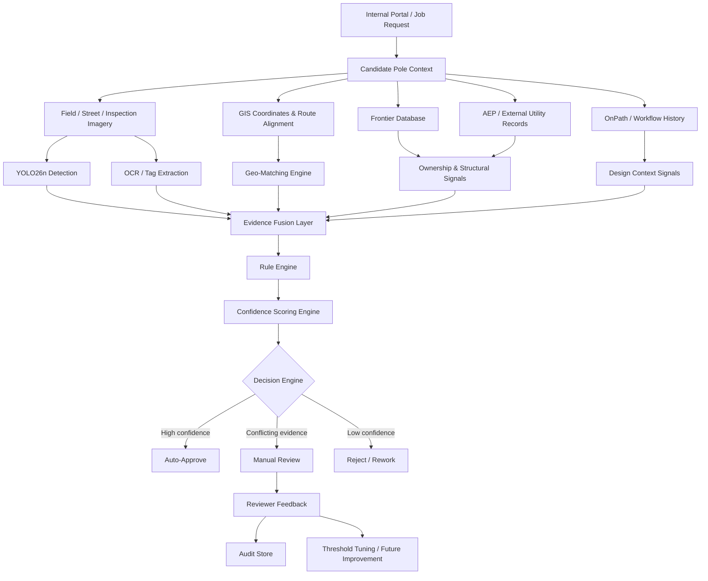

# AI-Powered Pole Validation

> Building an AI system that doesn’t just **detect poles** — but **validates and decides**.

---

## Vision

Modern infrastructure validation is slow, manual, and error-prone.

This project introduces an **AI-powered validation framework** that:
- Detects poles  
- Verifies ownership  
- Assesses structure  
- Provides decision-ready outputs  

---

## Why This Matters

:::note
Manual validation involves **13+ checks across multiple systems**.
:::

:::important
Wrong validation → **cost impact + safety risks + delays**
:::

:::tip
AI enables **confidence-based automated decisions**
:::

---

## What This System Does



---

## Core Capabilities

- Pole detection (YOLO26n)
- Ownership verification (AEP / Frontier DB)
- Structural assessment (visual + metadata)
- Space feasibility analysis
- Multi-source reconciliation
- Confidence-based decision engine

---

## Bento Overview

| Capability | Description |
|----------|------------|
| Pole Identity | Is this the correct pole? |
| Ownership | Frontier or not? |
| Ambiguity | Nearby pole confusion |
| Structure | Safe for attachment? |
| Decision | Approve / Review / Reject |

---

## YOLO26n Detection Engine

### Model Details
- Layers: 260  
- Parameters: 2.5M  
- Classes: 36  
- Framework: Ultralytics YOLO  

### Training Setup
- Epochs: 100  
- Batch: 16  
- Image Size: 640  

---

## Inference Example

```python
from ultralytics import YOLO

model = YOLO("best.pt")

results = model("pole.jpg")

for r in results:
    print(r.boxes)
```

---

## Confidence Engine

```python
def confidence_score(pole, ownership, geo, structure):
    return (
        pole * 0.3 +
        ownership * 0.2 +
        geo * 0.3 +
        structure * 0.2
    )
```

---

## Decision Logic

```python
def decision(score):
    if score > 0.85:
        return "Auto-Approve"
    elif score > 0.55:
        return "Manual Review"
    else:
        return "Reject"
```

---

## Performance Snapshot

| Metric | Value |
|------|------|
| Precision | 0.608 |
| Recall | 0.052 |
| mAP@0.5 | 0.054 |

:::warning
Low recall indicates **dataset limitation and class imbalance**
:::

---

## Current Challenges

- Small dataset  
- Class imbalance  
- Low recall  

---

## Next Improvements

- Increase dataset size  
- Improve labeling  
- Reduce class complexity  
- Apply active learning  

---

## Demo Videos

### Detection Demo
<iframe width="100%" height="400" src="https://www.youtube.com/embed/8ryD2qsKwbg"></iframe>

### Validation Demo
<iframe width="100%" height="400" src="https://www.youtube.com/embed/NlkDRsZflk4"></iframe>

---

## Key Innovation

:::important
This is not just object detection —  
it is **Decision Intelligence for Infrastructure**
:::

---

## Conclusion

This project transforms:

**Manual Validation → AI-Assisted Decision System**

- Combines vision + data + reasoning  
- Provides explainable decisions  
- Enables faster approvals  

---

## Final Thought

> From **detecting poles** → to **understanding and deciding infrastructure**
