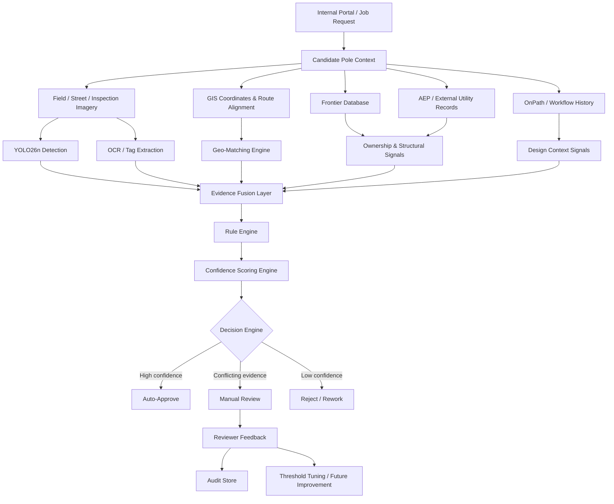

> Building an AI system that doesn’t just **detect poles** — but **validates and decides**.

::github{repo="dranubhaparashar/Pole-Detection"}

---


> Cover image source: [Source](https://github.com/dranubhaparashar/Pole-Detection)


---

## Vision

Modern infrastructure validation is slow, manual, and error-prone.

This project introduces an **AI-powered validation framework** that:
- Detects poles  
- Verifies ownership  
- Assesses structure  
- Provides decision-ready outputs  

---


## Project Attributes

| Attribute | Description |
|---|---|
| `problem-statement` | Manual pole validation is slow, fragmented, and dependent on multiple disconnected systems. |
| `primary-objective` | Build an AI-assisted framework to detect poles, validate ownership, assess suitability, and support decision-making. |
| `core-technologies` | YOLO, Computer Vision, GIS, OCR, and multi-source data reconciliation. |
| `validation-sources` | Internal portal data, field imagery, GIS coordinates, Frontier database, AEP records, and workflow history. |
| `key-capabilities` | Pole detection, ownership verification, structural assessment, ambiguity detection, and confidence-based decision support. |
| `decision-engine` | Produces outcomes such as Auto-Approve, Manual Review, or Reject / Rework based on fused evidence. |
| `business-impact` | Reduces manual effort, improves validation consistency, and speeds up infrastructure approval workflows. |
| `current-limitations` | Small dataset, class imbalance, and low recall in the current detection setup. |
| `future-improvements` | Expand dataset, improve labeling quality, reduce class complexity, and strengthen active learning. |
| `human-in-the-loop` | Final decisions should remain reviewer-supported until the model reaches stronger validation reliability. |

---

## Post Files


```plaintext title="Project + Blog Structure"
src/content/posts/
└── pole-detection/
    ├── cover.png
    └── index.mdx

GitHub Repo: dranubhaparashar/Pole-Detection/
├── dataset/
├── runs/
│   └── detect/
├── 001_png.rf.72b75e71c8e9e08119e23830becb46ea.jpg
├── 001_png.rf.72b75e71c8e9e08119e23830becb46ea.txt
├── 1.ipynb
├── 1.py
├── README.md
├── app.py
├── data.yaml
└── yolo26n.pt
```

---

## Why This Matters

:::note
Manual validation involves **13+ checks across multiple systems**.
:::

:::important
Wrong validation → **cost impact + safety risks + delays**
:::

:::tip
AI enables **confidence-based automated decisions**
:::

:::warning
Low recall indicates **dataset limitation and class imbalance**
:::

:::caution
Decisions should not be fully automated until model recall and validation coverage improve.
:::

---

## What This System Does



---

## Core Capabilities

- Pole detection (YOLO26n)
- Ownership verification (AEP / Frontier DB)
- Structural assessment (visual + metadata)
- Space feasibility analysis
- Multi-source reconciliation
- Confidence-based decision engine

---

## Bento Overview

| Capability | Description |
|----------|------------|
| Pole Identity | Is this the correct pole? |
| Ownership | Frontier or not? |
| Ambiguity | Nearby pole confusion |
| Structure | Safe for attachment? |
| Decision | Approve / Review / Reject |

---

## YOLO26n Detection Engine

### Model Details
- Layers: 260  
- Parameters: 2.5M  
- Classes: 36  
- Framework: Ultralytics YOLO  

### Training Setup
- Epochs: 100  
- Batch: 16  
- Image Size: 640  

---

## Inference 

```python title="inference.py" {"Import model":1} {"Load weights":3} ins={"Run inference":5} {"Inspect predictions":7-8}
from ultralytics import YOLO

model = YOLO("best.pt")

results = model("pole.jpg")

for r in results:
    print(r.boxes)
```

---

## Confidence Engine

```python title="confidence_engine.py" {"Weighted confidence logic":1-7} ins={"Reusable scoring":1-7}
def confidence_score(pole, ownership, geo, structure):
    return (
        pole * 0.3 +
        ownership * 0.2 +
        geo * 0.3 +
        structure * 0.2
    )
```

---

## Decision Logic

```python title="decision_logic.py" {"High-confidence path":2-3} ins={"Manual review band":4-5} {"Reject fallback":6-7}
def decision(score):
    if score > 0.85:
        return "Auto-Approve"
    elif score > 0.55:
        return "Manual Review"
    else:
        return "Reject"
```

---

## Example Threshold Update

```diff title="threshold-update.diff"
- AUTO_APPROVE_THRESHOLD = 0.90
- MANUAL_REVIEW_THRESHOLD = 0.60
+ AUTO_APPROVE_THRESHOLD = 0.85
+ MANUAL_REVIEW_THRESHOLD = 0.55
  REJECT_THRESHOLD = 0.00
```

---

## Runtime Example

```bash title="run-validation.sh"
python train.py --model yolo26n.pt --data data.yaml --epochs 100 --batch 16 --imgsz 640
python infer.py --weights best.pt --source pole.jpg
python evaluate.py --predictions outputs/results.json
```

---


## Performance Snapshot

| Metric | Value |
|------|------|
| Precision | 0.608 |
| Recall | 0.052 |
| mAP@0.5 | 0.054 |

:::warning
Low recall indicates **dataset limitation and class imbalance**
:::

:::caution
This system should remain human-assisted until model recall and evidence consistency improve.
:::

---

## Current Challenges

- Small dataset  
- Class imbalance  
- Low recall  

---

## Next Improvements

- Increase dataset size  
- Improve labeling  
- Reduce class complexity  
- Apply active learning  

---

## Demo Videos

### Detection Demo
<iframe width="100%" height="400" src="https://www.youtube.com/embed/8ryD2qsKwbg"></iframe>

### Validation Demo
<iframe width="100%" height="400" src="https://www.youtube.com/embed/NlkDRsZflk4"></iframe>

---

## Key Innovation

:::important
This is not just object detection —  
it is **Decision Intelligence for Infrastructure**
:::

---

## Conclusion

This project transforms:

**Manual Validation → AI-Assisted Decision System**

- Combines vision + data + reasoning.
- Provides explainable decisions.
- Enables faster approvals.

---

## Final Thought

> From **detecting poles** → to **understanding and deciding infrastructure** 

> The final recommendation is :spoiler[AI-assisted, not fully autonomous].
