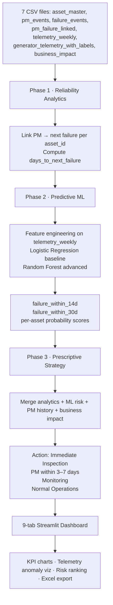
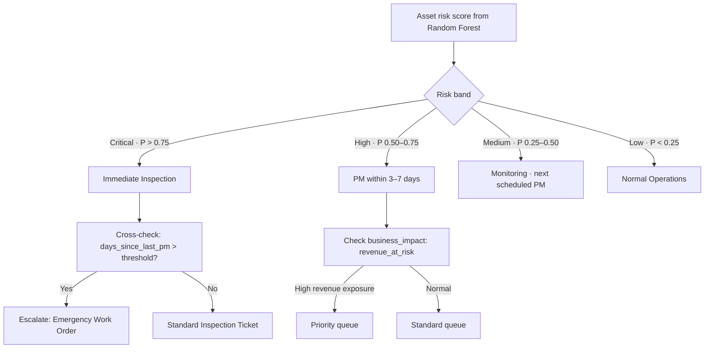
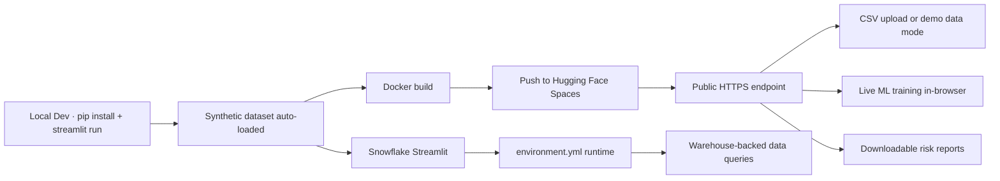

> Building a maintenance analytics platform that doesn't just **track failures** — but links PM events to subsequent breakdowns, trains classification models on telemetry signals, and turns risk scores into prescriptive maintenance plans.

::github{repo="dranubhaparashar/Predictive_Preventive_Maintenance_for_Generator_Reliability"}

---

> 🎥 **Live demo video:** [youtube.com/watch?v=QQSSFWxY_ro](https://www.youtube.com/watch?v=QQSSFWxY_ro)
>
> 🚀 **Try it live:** [Hugging Face Space](https://huggingface.co/spaces/AnubhaParashar/Predictive_Preventive_Maintenance_for_Generator_Reliability)

---

## Vision

Most maintenance teams know a generator failed. Very few can answer the harder question:

**After preventive maintenance is completed, how long does the generator actually run before the next failure?**

This project builds the full analytical chain that answers that question — and goes further, training ML models to predict which assets are about to fail next, then combining both into a prioritized action plan:

- Link every PM event to its subsequent failure for the same asset
- Compute `days_to_next_failure` as a measurable PM effectiveness metric
- Train Logistic Regression and Random Forest classifiers on weekly telemetry signals
- Predict `failure_within_14d` and `failure_within_30d` per asset
- Synthesize historical patterns, ML scores, and business-impact data into maintenance recommendations
- Expose everything through a 9-tab Streamlit dashboard with CSV upload, KPI summaries, and downloadable outputs
- Deploy to Hugging Face Spaces (Docker), Snowflake Streamlit, and local Python environments

---

## Project Attributes

| Attribute | Description |
|---|---|
| `problem-statement` | Maintenance teams treat PM as a cost with no measurable return. Without linking PM events to subsequent failures, there is no way to know whether scheduled maintenance is improving reliability or being done at the wrong intervals. |
| `primary-objective` | Build a data-driven platform that quantifies PM effectiveness, scores asset-level failure probability, and recommends prioritized maintenance actions. |
| `core-technologies` | Python, Streamlit, Pandas, NumPy, Scikit-learn, Plotly, Matplotlib, Docker, Hugging Face Spaces, Snowflake Streamlit. |
| `dataset-structure` | 7 CSV files: asset master, PM events, failure events, linked PM-failure pairs, weekly telemetry, labeled telemetry for ML, business impact. |
| `runtime-interface` | Streamlit 9-tab UI: Problem · Dataset · Executive KPIs · PM Effectiveness · Failures & Cost · Telemetry Risk · Predictive ML & PM Strategy · Saved Outputs · Data Explorer. |
| `deployment-target` | Hugging Face Spaces (Docker SDK) · Snowflake Streamlit (Python 3.11) · Local Python. |
| `demo-surface` | Public HF Space with embedded synthetic dataset; live model training in-browser. |
| `key-capabilities` | PM-to-failure event linking, on-time vs. delayed PM comparison, 14/30-day failure classification, feature importance, asset risk ranking, prescriptive action planner, KPI exports. |
| `production-focus` | Reproducible on real PM work orders and failure tickets with retraining; synthetic demo ships with the repo. |

---

## Three-Phase Architecture



---

## Why This Matters

:::note
A generator failure during a critical operation is not just a repair cost — it is downtime, SLA breach, customer revenue loss, and safety exposure. The difference between reactive and predictive maintenance is the ability to act **before** the failure event.
:::

:::important
PM effectiveness cannot be assumed. On-time PM may still result in early failure if intervals are wrong, parts degrade faster in certain environments, or specific asset models have higher intrinsic risk. Only by linking PM events to subsequent failures can teams validate whether their schedule is working.
:::

:::tip
The `days_to_next_failure` metric is deceptively simple. It compresses the entire PM-effectiveness question into a single comparable number per PM event, enabling distribution analysis, regional comparison, and model-type segmentation without requiring complex survival models.
:::

:::warning
ML predictions are only as good as the failure labels. The synthetic dataset ships with realistic label distributions, but production deployment requires genuine labeled failure outcomes and scheduled model retraining as operational patterns shift.
:::

:::caution
Business-impact figures (revenue loss, SLA penalties, customer exposure) in the demo are estimates based on synthetic data. Production use requires connecting real financial and SLA records to the failure event table.
:::

---

## Dataset Structure

| File | Purpose |
|---|---|
| `asset_master.csv` | Generator inventory: asset_id, model, region, criticality, environment_type, install_date |
| `pm_events.csv` | Scheduled and completed PM records with dates, technician, completion status, cost |
| `failure_events.csv` | Repair tickets with downtime hours, severity, root cause category, repair cost |
| `pm_failure_linked.csv` | Derived: each PM event linked to the next failure for that asset, with days_to_next_failure |
| `telemetry_weekly.csv` | Weekly sensor readings: temperature, vibration, fuel rate, alarm count, anomaly_score |
| `generator_telemetry_with_labels.csv` | Telemetry enriched with failure_within_14d and failure_within_30d binary labels |
| `business_impact.csv` | Revenue loss per outage, SLA breach counts, affected customers, financial exposure |

---

## Core Linking Algorithm

For each PM event, the platform:

1. Identifies the `asset_id` and PM completion date
2. Queries all failure events for that asset after the PM date
3. Selects the earliest subsequent failure
4. Computes `days_to_next_failure = failure_date − pm_completion_date`

This produces one row per PM event with a measurable survival duration — the foundation for all downstream analytics and model training.

```python title="pm_to_failure_linker.py"
def link_pm_to_next_failure(pm_events: pd.DataFrame, failure_events: pd.DataFrame) -> pd.DataFrame:
    records = []
    for _, pm in pm_events.iterrows():
        asset_failures = failure_events[
            (failure_events["asset_id"] == pm["asset_id"]) &
            (failure_events["failure_date"] > pm["pm_completion_date"])
        ].sort_values("failure_date")

        if not asset_failures.empty:
            next_failure = asset_failures.iloc[0]
            records.append({
                "pm_id": pm["pm_id"],
                "asset_id": pm["asset_id"],
                "pm_completion_date": pm["pm_completion_date"],
                "next_failure_date": next_failure["failure_date"],
                "days_to_next_failure": (
                    next_failure["failure_date"] - pm["pm_completion_date"]
                ).days,
                "pm_on_time": pm["pm_on_time"],
                "failure_severity": next_failure["severity"],
            })
    return pd.DataFrame(records)
```

---

## Machine Learning Pipeline

### Feature Set

| Feature | Source | Why It Matters |
|---|---|---|
| `days_since_last_pm` | pm_events | Longer gaps increase failure risk |
| `runtime_hours_week` | telemetry_weekly | High utilization accelerates wear |
| `oil_temperature` | telemetry_weekly | Thermal stress indicator |
| `coolant_temperature` | telemetry_weekly | Cooling system degradation signal |
| `battery_voltage` | telemetry_weekly | Electrical system health |
| `vibration` | telemetry_weekly | Mechanical wear proxy |
| `fuel_rate` | telemetry_weekly | Efficiency drop = early warning |
| `alarm_count` | telemetry_weekly | Cumulative fault indicators |
| `anomaly_score` | telemetry_weekly | Composite deviation metric |
| `model`, `region`, `criticality`, `environment_type` | asset_master | Asset-class risk stratification |

### Models

| Model | Role | Strength |
|---|---|---|
| Logistic Regression | Baseline | Interpretable coefficients, fast inference |
| Random Forest | Production | Captures nonlinear interactions, feature importance ranking |

### Outputs per Model

- Accuracy, Precision, Recall, F1, ROC AUC
- Confusion matrices (14d and 30d horizons)
- Feature importance bar charts
- Per-asset failure probability scores
- Risk band classification: Critical / High / Medium / Low

---

## Prescriptive Action Logic



---

## Dashboard Tabs

| Tab | Content |
|---|---|
| Problem & Solution | Business context: the cost of reactive maintenance and the PM-effectiveness gap |
| Dataset & Raw → Algorithm | CSV preview, PM linking logic, enrichment walkthrough |
| Executive KPIs | Total downtime, repair costs, PM completion rate, SLA breach count |
| PM Effectiveness | `days_to_next_failure` distribution, on-time vs. delayed PM comparison, model/region breakdown |
| Failures & Cost | Failure severity breakdown, root cause categories, cost per failure, top assets by downtime |
| Telemetry Risk | Anomaly score trends, sensor heatmaps, aging asset identification |
| Predictive ML & PM Strategy | Model training, confusion matrices, feature importance, risk rankings, action plan table |
| Saved Outputs | Exported figures and result tables from current session |
| Data Explorer & Export | Filtered dataset views, downloadable CSV and Excel exports |

---

## Bento Overview

| Layer | Description |
|---|---|
| Data Layer | 7 CSV files covering asset inventory, PM history, failures, telemetry, and business impact |
| Analytics Layer | PM-to-failure linker producing `days_to_next_failure` per PM event |
| ML Layer | Logistic Regression + Random Forest classifiers for 14d and 30d failure horizons |
| Prescriptive Layer | Risk-band action planner combining ML scores, PM history, and financial exposure |
| UI Layer | Streamlit 9 tabs: executive summary → telemetry → ML training → data export |
| Deployment Layer | Docker image for HF Spaces · Snowflake Streamlit · Local pip install |

---

## Dependency Stack

```txt title="requirements.txt"
streamlit>=1.28,<2.0
pandas>=2.0
numpy>=1.24
scikit-learn>=1.3
plotly>=5.18
matplotlib>=3.7
openpyxl>=3.1
python-dateutil>=2.8
```

---

## Containerization

```dockerfile title="Dockerfile" {"Base":1} {"User":7-11} {"Install deps":13-15} {"Streamlit start":21-27}
FROM python:3.11-slim

RUN apt-get update && apt-get install -y --no-install-recommends \
    build-essential \
    && rm -rf /var/lib/apt/lists/*

RUN useradd -m -u 1000 user
USER user
ENV PATH="/home/user/.local/bin:$PATH"
WORKDIR /home/user/app

COPY --chown=user requirements.txt requirements.txt
RUN pip install --no-cache-dir --upgrade pip && \
    pip install --no-cache-dir -r requirements.txt

COPY --chown=user . .

EXPOSE 7860

CMD ["streamlit", "run", "streamlit_app.py", \
     "--server.port=7860", \
     "--server.address=0.0.0.0", \
     "--server.headless=true", \
     "--server.enableCORS=false", \
     "--server.enableXsrfProtection=false", \
     "--browser.gatherUsageStats=false"]
```

---

## Deployment Path



---

## Runtime Example

```bash title="run-locally.sh"
# Clone the repo
git clone https://github.com/dranubhaparashar/Predictive_Preventive_Maintenance_for_Generator_Reliability.git
cd Predictive_Preventive_Maintenance_for_Generator_Reliability

# Create virtual environment
python -m venv pm_env
source pm_env/bin/activate

# Install dependencies
pip install -r requirements.txt

# Run the app
streamlit run streamlit_app.py --server.port 8505

# Open http://localhost:8505
# Auto-loads synthetic generator dataset
# Navigate to "Predictive ML & PM Strategy" tab to train models
# Export risk rankings from the Data Explorer tab
```

---

## Demo Video

<iframe
  width="100%"
  height="400"
  src="https://www.youtube.com/embed/QQSSFWxY_ro"
  title="Predictive Preventive Maintenance for Generator Reliability Demo"
  frameborder="0"
  allow="accelerometer; autoplay; clipboard-write; encrypted-media; gyroscope; picture-in-picture"
  allowfullscreen>
</iframe>

---

## Public Demo Surfaces

:::important
The Hugging Face Space provides instant browser-based access to the full dashboard with the embedded synthetic dataset — no local install required. The GitHub repository contains source code, architecture docs, and the function reference wiki.
:::

### Demo Links

- **🚀 Live App:** [AnubhaParashar / Predictive_Preventive_Maintenance_for_Generator_Reliability](https://huggingface.co/spaces/AnubhaParashar/Predictive_Preventive_Maintenance_for_Generator_Reliability)
- **📦 GitHub Repository:** [Predictive_Preventive_Maintenance_for_Generator_Reliability](https://github.com/dranubhaparashar/Predictive_Preventive_Maintenance_for_Generator_Reliability)
- **📚 Wiki Documentation:** [Architecture · Function Reference · Technical Spec](https://github.com/dranubhaparashar/Predictive_Preventive_Maintenance_for_Generator_Reliability/wiki)

---

## Engineering Value

This project is not just about predicting failures.

It demonstrates how to take raw maintenance records and sensor data and make them:

- **measurable** — PM effectiveness expressed as a single comparable metric per event
- **predictive** — binary classifiers producing per-asset failure probabilities with calibrated horizons
- **prescriptive** — risk scores translated into prioritized action recommendations with business-impact weighting
- **interactive** — 9-tab Streamlit UI that works with any CSV upload or the embedded demo data
- **containerized** — Docker image deployable to Hugging Face, Snowflake, or any container host
- **publicly demoable** — HF Space with synthetic dataset and live model training

---

## Current Strengths

- PM-to-failure linker produces a deterministic, interpretable reliability metric without ML
- On-time vs. delayed PM comparison quantifies the operational cost of deferred maintenance
- Two-model approach gives both interpretability (LR coefficients) and accuracy (RF feature importance)
- Dual prediction horizons (14d and 30d) support both urgent dispatch and weekly planning cycles
- Prescriptive action layer closes the loop from prediction to work-order recommendation
- Multi-platform deployment (HF Spaces, Snowflake, local) accommodates different production constraints
- Synthetic dataset is structurally identical to real production schemas — swap files to go live

---

## Next Improvements

- Connect real PM work-order systems (Maximo, ServiceNow, SAP PM) via API
- Add survival analysis (Kaplan-Meier, Cox regression) alongside classification models
- Implement scheduled model retraining with labeled failure outcome ingestion
- Add alerting integration: email or Slack notification on Critical risk assets
- Add multi-asset comparison dashboard for fleet-level reliability benchmarking
- Add time-series anomaly detection (LSTM or Isolation Forest) on raw telemetry streams
- Add Snowflake-native scheduled refresh with Streamlit Tasks
- Add confidence intervals on ML predictions for uncertainty-aware decision making
- Add A/B testing framework for PM interval variants
- Add geospatial map view for regional failure density analysis

---

## Key Innovation

:::important
This project connects **PM effectiveness measurement** with **predictive ML risk scoring** and **prescriptive action planning** — three layers that maintenance teams typically operate separately in disconnected spreadsheets and dashboards.
:::

It turns:

**Raw maintenance logs → Survival duration per PM event → Failure probability per asset → Prioritized maintenance action per generator**

rather than stopping at failure reporting.

The `days_to_next_failure` linker is the keystone — it shows that **operational history (what happened after each PM) is just as valuable as sensor telemetry** when building a reliability model.

---

## Conclusion

This repository shows how generator maintenance analytics can evolve from reactive failure tracking into a predictive reliability workflow with prescriptive recommendations.

It combines:

- Deterministic PM-to-failure event linking with `days_to_next_failure` as the core metric
- Supervised ML classifiers (Logistic Regression + Random Forest) for 14/30-day failure horizons
- Prescriptive action planner merging risk scores with business-impact data
- 9-tab Streamlit UI covering the full analytical journey from raw data to maintenance actions
- Synthetic dataset mirroring real production schemas for immediate portability
- Docker deployment to Hugging Face Spaces and Snowflake Streamlit
- Comprehensive wiki documentation covering architecture and function references

---

## Final Thought

> From **counting failures**
> to **predicting them before they happen — and telling you what to do about it**

> The real value is not only the Random Forest classifier — it is the **PM effectiveness metric, the prescriptive action layer, and the business-impact weighting** that together make the system operationally useful rather than just analytically interesting.

> 9 dashboard tabs · 2 ML models · 2 failure horizons · 7 input datasets · 1 clear recommendation per generator.
